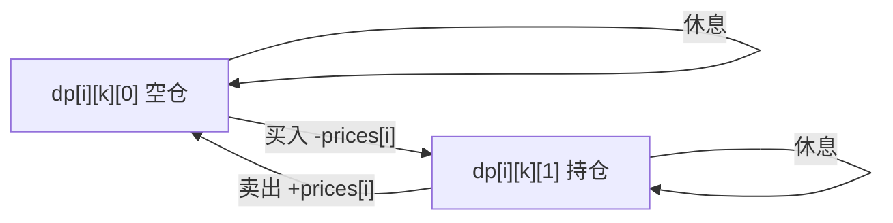

# 股票买卖问题：状态机 DP 的万能框架

## 一、问题族全景

LeetCode 上有 6 道经典股票题，看似各不相同，实则共享**同一个状态机框架**：

| 题目 | 限制 | 核心差异 |
|------|------|----------|
| 121. 买卖股票的最佳时机 | 最多 1 笔 | 退化版 |
| 122. 买卖股票的最佳时机 II | 无限笔 | 贪心也可解 |
| 123. 买卖股票的最佳时机 III | 最多 2 笔 | k=2 特例 |
| 188. 买卖股票的最佳时机 IV | 最多 k 笔 | 通用版 |
| 309. 最佳买卖股票时机含冷冻期 | 无限笔 + 冷冻期 | 状态扩展 |
| 714. 买卖股票的最佳时机含手续费 | 无限笔 + 手续费 | 转移修正 |

## 二、状态机框架

### 2.1 状态定义

每天结束时，你处于以下状态之一：

```text
dp[i][k][0] = 第 i 天结束，最多进行了 k 笔交易，手中【没有】股票时的最大利润
dp[i][k][1] = 第 i 天结束，最多进行了 k 笔交易，手中【持有】股票时的最大利润
```

### 2.2 状态转移图



### 2.3 转移方程（通用）

```text
dp[i][k][0] = max(dp[i-1][k][0], dp[i-1][k][1] + prices[i])
              // 昨天就空仓        // 昨天持仓今天卖出

dp[i][k][1] = max(dp[i-1][k][1], dp[i-1][k-1][0] - prices[i])
              // 昨天就持仓        // 昨天空仓今天买入（消耗一次交易机会）
```

**关键约定**：买入时消耗交易次数（k-1 发生在买入时）。

### 2.4 边界条件

```text
dp[-1][k][0] = 0          // 还没开始，空仓利润为 0
dp[-1][k][1] = -∞         // 还没开始就持仓，不可能
dp[i][0][0] = 0           // 0 次交易机会，只能空仓
dp[i][0][1] = -∞          // 0 次交易机会，不可能持仓
```

## 三、逐题击破

### 3.1 k=1：最多一笔（LC 121）

k 恒为 1，`dp[i-1][0][0] = 0`，方程退化：

```text
dp[i][0] = max(dp[i-1][0], dp[i-1][1] + prices[i])
dp[i][1] = max(dp[i-1][1], -prices[i])
```

```java tab
public int maxProfit(int[] prices) {
    int cash = 0, hold = Integer.MIN_VALUE;
    for (int price : prices) {
        cash = Math.max(cash, hold + price);
        hold = Math.max(hold, -price);
    }
    return cash;
}
```

```typescript tab
function maxProfit(prices: number[]): number {
    let cash = 0, hold = -Infinity;
    for (const price of prices) {
        cash = Math.max(cash, hold + price);
        hold = Math.max(hold, -price);
    }
    return cash;
}
```

```python tab
def maxProfit(prices: list[int]) -> int:
    cash, hold = 0, float('-inf')
    for price in prices:
        cash = max(cash, hold + price)
        hold = max(hold, -price)
    return cash
```

**等价理解**：`hold = max(hold, -price)` 就是在追踪历史最低价。

### 3.2 k=∞：无限笔（LC 122）

k 无限大时 `k-1 ≈ k`，k 维度消失：

```text
dp[i][0] = max(dp[i-1][0], dp[i-1][1] + prices[i])
dp[i][1] = max(dp[i-1][1], dp[i-1][0] - prices[i])
```

```typescript tab
function maxProfit(prices: number[]): number {
    let cash = 0, hold = -Infinity;
    for (const price of prices) {
        const prevCash = cash;
        cash = Math.max(cash, hold + price);
        hold = Math.max(hold, prevCash - price);
    }
    return cash;
}
```

**贪心等价**：所有上涨日的差值之和 `Σ max(0, prices[i] - prices[i-1])`。

### 3.3 k=2：最多两笔（LC 123）

k 只有 1 和 2 两个有效值，展开为 4 个变量：

```typescript tab
function maxProfit(prices: number[]): number {
    // buy1: 第一次买入后的最大利润（负数）
    // sell1: 第一次卖出后的最大利润
    // buy2: 第二次买入后的最大利润
    // sell2: 第二次卖出后的最大利润
    let buy1 = -Infinity, sell1 = 0, buy2 = -Infinity, sell2 = 0;
    for (const price of prices) {
        buy1 = Math.max(buy1, -price);
        sell1 = Math.max(sell1, buy1 + price);
        buy2 = Math.max(buy2, sell1 - price);
        sell2 = Math.max(sell2, buy2 + price);
    }
    return sell2;
}
```

```java tab
public int maxProfit(int[] prices) {
    int buy1 = Integer.MIN_VALUE, sell1 = 0;
    int buy2 = Integer.MIN_VALUE, sell2 = 0;
    for (int price : prices) {
        buy1 = Math.max(buy1, -price);
        sell1 = Math.max(sell1, buy1 + price);
        buy2 = Math.max(buy2, sell1 - price);
        sell2 = Math.max(sell2, buy2 + price);
    }
    return sell2;
}
```

**注意更新顺序**：同一天内 buy1→sell1→buy2→sell2 依次更新，允许当天买卖（利润为 0，不影响结果）。

### 3.4 通用 k 笔（LC 188）

```typescript tab
function maxProfit(k: number, prices: number[]): number {
    const n = prices.length;
    if (k >= n >> 1) {
        // k 足够大，退化为无限笔
        let profit = 0;
        for (let i = 1; i < n; i++) profit += Math.max(0, prices[i] - prices[i - 1]);
        return profit;
    }

    const buy = new Array(k + 1).fill(-Infinity);
    const sell = new Array(k + 1).fill(0);
    for (const price of prices) {
        for (let j = 1; j <= k; j++) {
            buy[j] = Math.max(buy[j], sell[j - 1] - price);
            sell[j] = Math.max(sell[j], buy[j] + price);
        }
    }
    return sell[k];
}
```

**优化要点**：当 `k ≥ n/2` 时，交易次数不构成约束，退化为贪心，避免 O(n·k) 爆炸。

### 3.5 含冷冻期（LC 309）

卖出后次日不能买入。修改买入转移：从 `dp[i-2][0]`（两天前的空仓状态）买入：

```typescript tab
function maxProfit(prices: number[]): number {
    let cash = 0;           // 空仓
    let hold = -Infinity;   // 持仓
    let prevCash = 0;       // 前一天的空仓（冷冻期用）
    for (const price of prices) {
        const temp = cash;
        cash = Math.max(cash, hold + price);
        hold = Math.max(hold, prevCash - price);  // 只能从两天前状态买入
        prevCash = temp;
    }
    return cash;
}
```

```python tab
def maxProfit(prices: list[int]) -> int:
    cash, hold, prev_cash = 0, float('-inf'), 0
    for price in prices:
        temp = cash
        cash = max(cash, hold + price)
        hold = max(hold, prev_cash - price)
        prev_cash = temp
    return cash
```

### 3.6 含手续费（LC 714）

卖出时扣手续费 `fee`：

```typescript tab
function maxProfit(prices: number[], fee: number): number {
    let cash = 0, hold = -Infinity;
    for (const price of prices) {
        const prevCash = cash;
        cash = Math.max(cash, hold + price - fee);  // 卖出时扣费
        hold = Math.max(hold, prevCash - price);
    }
    return cash;
}
```

也可以把 fee 放在买入时扣（`hold = max(hold, prevCash - price - fee)`），结果相同。

## 四、框架总结表

| 题目 | 状态数 | 特殊处理 |
|------|--------|----------|
| k=1 | cash, hold | hold 只能从 0 买入 |
| k=∞ | cash, hold | 无限制 |
| k=2 | 4 变量链式更新 | 顺序依赖 |
| k 通用 | buy[k], sell[k] | k≥n/2 退化贪心 |
| 冷冻期 | cash, hold, prevCash | 买入看两天前 |
| 手续费 | cash, hold | 卖出/买入时 -fee |

## 五、如何识别股票题

| 信号 | 思路 |
|------|------|
| "最多买卖 k 次" | 状态机 DP，k 维度 |
| "不限次数" | 贪心（上涨就赚）或状态机 |
| "冷冻期/冷却" | 增加延迟状态 |
| "手续费" | 转移时减 fee |
| "只能持有一股" | 天然满足状态机假设 |

## 六、面试常见题

- 🟢 LC 121. 买卖股票的最佳时机（一次交易）
- 🟡 LC 122. 买卖股票的最佳时机 II（无限次）
- 🔴 LC 123. 买卖股票的最佳时机 III（两次）
- 🔴 LC 188. 买卖股票的最佳时机 IV（k 次）
- 🟡 LC 309. 最佳买卖股票时机含冷冻期
- 🟡 LC 714. 买卖股票的最佳时机含手续费

## 七、易错点

1. **买入 vs 卖出消耗 k**：统一约定"买入时 k-1"，混用会导致多算交易次数。
2. **k=∞ 时忘记退化**：LC 188 不判 `k ≥ n/2` 会 TLE/MLE。
3. **冷冻期修改位置错误**：是**买入**受限（从前天状态买），不是卖出。
4. **同一天买卖**：链式更新天然允许，利润为 0 不影响正确性。

## 八、心法口诀

> **每天两态空与持，买入卖出售转移；**
> **k 笔限制开数组，冷冻手续改转移。**
