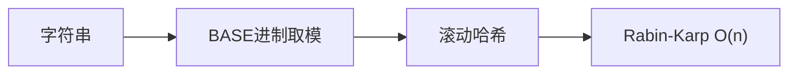

# 字符串哈希与 Rabin-Karp

字符串哈希将字符串映射为整数，实现 O(1) 的子串比较。Rabin-Karp 算法利用滚动哈希在 O(n) 时间内完成模式匹配，并天然支持多模式匹配。

## 一、字符串哈希原理



将字符串视为 BASE 进制数：

```
hash("abc") = a × BASE² + b × BASE¹ + c × BASE⁰
```

常用参数：
- BASE = 131 或 13331（质数）
- MOD = 2⁶⁴（自然溢出）或 10⁹+7

### 前缀哈希

```java tab
long[] hash = new long[n + 1];
long[] power = new long[n + 1];
power[0] = 1;
for (int i = 1; i <= n; i++) {
    hash[i] = hash[i - 1] * BASE + s.charAt(i - 1);
    power[i] = power[i - 1] * BASE;
}

// 子串 s[l..r] 的哈希值（0-indexed）
long getHash(int l, int r) {
    return hash[r + 1] - hash[l] * power[r - l + 1];
}
```

```typescript tab
const hash = new Array(n + 1).fill(0);
const power = new Array(n + 1).fill(0);
power[0] = 1;
for (let i = 1; i <= n; i++) {
    hash[i] = hash[i - 1] * BASE + s.charCodeAt(i - 1);
    power[i] = power[i - 1] * BASE;
}

// 子串 s[l..r] 的哈希值（0-indexed）
function getHash(l: number, r: number): number {
    return hash[r + 1] - hash[l] * power[r - l + 1];
}
```

```python tab
hash_arr = [0] * (n + 1)
power = [0] * (n + 1)
power[0] = 1
for i in range(1, n + 1):
    hash_arr[i] = hash_arr[i - 1] * BASE + ord(s[i - 1])
    power[i] = power[i - 1] * BASE

# 子串 s[l..r] 的哈希值（0-indexed）
def get_hash(l: int, r: int) -> int:
    return hash_arr[r + 1] - hash_arr[l] * power[r - l + 1]
```

## 二、Rabin-Karp 匹配

```java tab
int rabinKarp(String text, String pattern) {
    int n = text.length(), m = pattern.length();
    if (m > n) return -1;

    long patHash = 0, winHash = 0;
    long basePow = 1; // BASE^(m-1)
    for (int i = 0; i < m; i++) {
        patHash = patHash * BASE + pattern.charAt(i);
        winHash = winHash * BASE + text.charAt(i);
        if (i > 0) basePow *= BASE;
    }

    for (int i = 0; i <= n - m; i++) {
        if (winHash == patHash) {
            // 哈希相等 → 验证（防冲突）
            if (text.substring(i, i + m).equals(pattern)) return i;
        }
        // 滚动：去掉最高位，加入新低位
        if (i < n - m) {
            winHash = (winHash - text.charAt(i) * basePow) * BASE + text.charAt(i + m);
        }
    }
    return -1;
}
```

```typescript tab
function rabinKarp(text: string, pattern: string): number {
    const n = text.length, m = pattern.length;
    if (m > n) return -1;

    let patHash = 0, winHash = 0;
    let basePow = 1; // BASE^(m-1)
    for (let i = 0; i < m; i++) {
        patHash = patHash * BASE + pattern.charCodeAt(i);
        winHash = winHash * BASE + text.charCodeAt(i);
        if (i > 0) basePow *= BASE;
    }

    for (let i = 0; i <= n - m; i++) {
        if (winHash === patHash) {
            // 哈希相等 → 验证（防冲突）
            if (text.slice(i, i + m) === pattern) return i;
        }
        // 滚动：去掉最高位，加入新低位
        if (i < n - m) {
            winHash = (winHash - text.charCodeAt(i) * basePow) * BASE + text.charCodeAt(i + m);
        }
    }
    return -1;
}
```

```python tab
def rabin_karp(text: str, pattern: str) -> int:
    n, m = len(text), len(pattern)
    if m > n:
        return -1

    pat_hash, win_hash = 0, 0
    base_pow = 1  # BASE^(m-1)
    for i in range(m):
        pat_hash = pat_hash * BASE + ord(pattern[i])
        win_hash = win_hash * BASE + ord(text[i])
        if i > 0:
            base_pow *= BASE

    for i in range(n - m + 1):
        if win_hash == pat_hash:
            # 哈希相等 → 验证（防冲突）
            if text[i:i + m] == pattern:
                return i
        # 滚动：去掉最高位，加入新低位
        if i < n - m:
            win_hash = (win_hash - ord(text[i]) * base_pow) * BASE + ord(text[i + m])
    return -1
```

## 三、滚动哈希的核心

```
窗口 [i, i+m-1] → [i+1, i+m]

旧哈希: h = s[i]·B^(m-1) + s[i+1]·B^(m-2) + ... + s[i+m-1]
新哈希: h' = (h - s[i]·B^(m-1)) · B + s[i+m]
```

O(1) 滑动一步 → 总共 O(n)。

## 四、应用场景

### 1. 最长重复子串（二分 + 哈希）

```java tab
// LeetCode 1044
int longestDupSubstring(String s) {
    int n = s.length(), lo = 1, hi = n - 1, start = 0;
    while (lo <= hi) {
        int mid = (lo + hi) / 2;
        int pos = check(s, mid);
        if (pos >= 0) { start = pos; lo = mid + 1; }
        else hi = mid - 1;
    }
    return s.substring(start, start + hi);
}
```

```typescript tab
// LeetCode 1044
function longestDupSubstring(s: string): string {
    const n = s.length;
    let lo = 1, hi = n - 1, start = 0;
    while (lo <= hi) {
        const mid = Math.floor((lo + hi) / 2);
        const pos = check(s, mid);
        if (pos >= 0) { start = pos; lo = mid + 1; }
        else hi = mid - 1;
    }
    return s.slice(start, start + hi);
}
```

```python tab
# LeetCode 1044
def longest_dup_substring(s: str) -> str:
    n = len(s)
    lo, hi, start = 1, n - 1, 0
    while lo <= hi:
        mid = (lo + hi) // 2
        pos = check(s, mid)
        if pos >= 0:
            start = pos
            lo = mid + 1
        else:
            hi = mid - 1
    return s[start:start + hi]
```

### 2. 多模式匹配

将所有模式串的哈希存入 HashSet，滑动窗口逐一比对。

### 3. 回文判断

正向哈希 == 反向哈希 → 回文。

## 五、哈希冲突处理

| 策略 | 方法 |
|------|------|
| 双哈希 | 用两组 (BASE, MOD)，冲突概率 ~10⁻¹⁸ |
| 验证 | 哈希相等时逐字符确认 |
| 大质数 MOD | 10⁹+7, 10⁹+9, 998244353 |
| 自然溢出 | unsigned long long，MOD = 2⁶⁴ |

## 六、复杂度

| 操作 | 时间 |
|------|------|
| 预处理前缀哈希 | O(n) |
| 单次子串哈希查询 | O(1) |
| Rabin-Karp 匹配 | O(n) 平均 |
| 最长重复子串 | O(n log n) |

## 七、面试要点

1. **滚动哈希公式**：去高位、乘 BASE、加低位
2. **BASE 选择**：大于字符集大小的质数
3. **冲突**：面试中提一句“双哈希”或“验证”即可
4. **与 KMP 对比**：Rabin-Karp 更适合多模式；KMP 无冲突
5. **LeetCode**：1044（最长重复子串）、187（重复 DNA 序列）、718（最长重复子数组）

## 八、滚动哈希计算过程模拟

以 `s = "abcd"`，窗口长 3，BASE=31，MOD=1e9+7 为例，计算各窗口哈希：

```
窗口 "abc": h = ((a*31 + b)*31 + c)
            = a*31² + b*31 + c

窗口右移一位 → "bcd"：
  旧哈希 h("abc") = a*31² + b*31 + c
  ① 去掉高位 a：h - a*31² = b*31 + c
  ② 整体乘 31：  b*31² + c*31
  ③ 加上新低位 d：b*31² + c*31 + d = h("bcd") ✓

通用公式：
  h(new) = ( (h(old) - s[i]*pow) * BASE + s[i+len] ) % MOD
  其中 pow = BASE^(len-1) % MOD（预先算好）
```

**为什么每个窗口 O(1)**：不需要重新计算整个窗口，只依赖上一个窗口的哈希值，这是“滚动”的含义。n 个窗口总耗时 O(n)。

## 九、双哈希防冲突

单哈希在大数据量下存在冲突风险（生日悖论）。工程与竞赛中常用**双哈希**：

```python tab
# 双哈希：用两组不同的 (BASE, MOD)，冲突概率近似为两者乘积
def double_hash(s: str):
    h1 = h2 = 0
    B1, B2 = 131, 13331
    M1, M2 = 10**9 + 7, 10**9 + 9
    for ch in s:
        h1 = (h1 * B1 + ord(ch)) % M1
        h2 = (h2 * B2 + ord(ch)) % M2
    return (h1, h2)  # 用元组作为唯一标识
```

两个不同字符串同时碰撞两组参数的概率极低（约 `1/M1 * 1/M2`），实践中可视为无误。

## 十、思考题

1. Rabin-Karp 的窗口哈希是 O(1) 转移的，为什么整体复杂度仍是 O(n) 而不是 O(1)？（提示：共有 n-len+1 个窗口）
2. 为什么 BASE 要选大于字符集大小的质数？如果 BASE=1 会发生什么？（提示："ab" 和 "ba" 哈希相同）
3. LC 1044 求最长重复子串，为什么要结合“二分答案 + 滚动哈希”？直接枚举所有子串对为什么超时？（提示：O(n² log n) vs O(n log n)）

> 练习推荐：先掌握 [KMP 算法](/tutorials/kmp) 体会单模式匹配，再用滚动哈希挑战 LC 1044。
