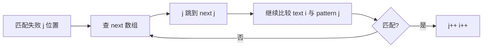

# 字符串匹配：从暴力到 KMP


## 一、问题定义

**字符串匹配（Pattern Matching）**：在文本串 `text`（长度 n）中查找模式串 `pattern`（长度 m）出现的位置。

| 算法 | 时间复杂度 | 核心思想 |
|------|-----------|----------|
| 暴力匹配 | O(nm) | 逐位对齐比较 |
| KMP | O(n + m) | 利用已匹配信息避免回退 |
| Rabin-Karp | O(n + m) 平均 | 哈希 + 滑动窗口 |
| Boyer-Moore | O(n/m) 最好 | 坏字符 + 好后缀 |

> 面试中 **KMP** 是绝对重点，Rabin-Karp 了解即可。

## 二、暴力匹配

```java tab
public int strStr(String text, String pattern) {
    int n = text.length(), m = pattern.length();
    for (int i = 0; i <= n - m; i++) {
        int j = 0;
        while (j < m && text.charAt(i + j) == pattern.charAt(j)) {
            j++;
        }
        if (j == m) return i;
    }
    return -1;
}
```

```typescript tab
function strStr(text: string, pattern: string): number {
    const n = text.length, m = pattern.length;
    for (let i = 0; i <= n - m; i++) {
        let j = 0;
        while (j < m && text[i + j] === pattern[j]) {
            j++;
        }
        if (j === m) return i;
    }
    return -1;
}
```

```python tab
def str_str(text: str, pattern: str) -> int:
    n, m = len(text), len(pattern)
    for i in range(n - m + 1):
        j = 0
        while j < m and text[i + j] == pattern[j]:
            j += 1
        if j == m:
            return i
    return -1
```

- **时间**：最坏 O(nm)（如 `text = "aaaaab"`, `pattern = "aaab"`）
- **问题**：匹配失败后 `i` 回退，已比较的信息被浪费。

## 三、KMP 算法

### 3.1 核心思想

当 `text[i] != pattern[j]` 时，**i 不回退**，而是将 j 跳转到 `next[j-1]`（已匹配前缀 `pattern[0..j-1]` 的最长相等前后缀的长度），利用已匹配的前缀信息跳过不可能的对齐。



### 3.2 next 数组（前缀函数）

`next[i]` = `pattern[0..i]` 的**最长相等真前后缀**长度。

| pattern | a | b | a | b | a | c |
|---------|---|---|---|---|---|---|
| index | 0 | 1 | 2 | 3 | 4 | 5 |
| next | 0 | 0 | 1 | 2 | 3 | 0 |

### 3.3 构建 next 数组

```java tab
private int[] buildNext(String pattern) {
    int m = pattern.length();
    int[] next = new int[m];
    int j = 0;                       // next[0] = 0
    for (int i = 1; i < m; i++) {
        while (j > 0 && pattern.charAt(i) != pattern.charAt(j)) {
            j = next[j - 1];         // 回退
        }
        if (pattern.charAt(i) == pattern.charAt(j)) {
            j++;
        }
        next[i] = j;
    }
    return next;
}
```

```typescript tab
function buildNext(pattern: string): number[] {
    const m = pattern.length;
    const next = new Array(m).fill(0);
    let j = 0;                       // next[0] = 0
    for (let i = 1; i < m; i++) {
        while (j > 0 && pattern[i] !== pattern[j]) {
            j = next[j - 1];         // 回退
        }
        if (pattern[i] === pattern[j]) {
            j++;
        }
        next[i] = j;
    }
    return next;
}
```

```python tab
def build_next(pattern: str) -> list:
    m = len(pattern)
    nxt = [0] * m
    j = 0  # nxt[0] = 0
    for i in range(1, m):
        while j > 0 and pattern[i] != pattern[j]:
            j = nxt[j - 1]  # 回退
        if pattern[i] == pattern[j]:
            j += 1
        nxt[i] = j
    return nxt
```

- **时间**：O(m)

### 3.4 KMP 匹配

```java tab
public int strStr(String text, String pattern) {
    int n = text.length(), m = pattern.length();
    if (m == 0) return 0;
    int[] next = buildNext(pattern);
    int j = 0;
    for (int i = 0; i < n; i++) {
        while (j > 0 && text.charAt(i) != pattern.charAt(j)) {
            j = next[j - 1];         // j 回退，i 不动
        }
        if (text.charAt(i) == pattern.charAt(j)) {
            j++;
        }
        if (j == m) {
            return i - m + 1;        // 找到匹配
            // 若找所有匹配：j = next[j - 1]; 继续
        }
    }
    return -1;
}
```

```typescript tab
function strStr(text: string, pattern: string): number {
    const n = text.length, m = pattern.length;
    if (m === 0) return 0;
    const next = buildNext(pattern);
    let j = 0;
    for (let i = 0; i < n; i++) {
        while (j > 0 && text[i] !== pattern[j]) {
            j = next[j - 1];         // j 回退，i 不动
        }
        if (text[i] === pattern[j]) {
            j++;
        }
        if (j === m) {
            return i - m + 1;        // 找到匹配
            // 若找所有匹配：j = next[j - 1]; 继续
        }
    }
    return -1;
}
```

```python tab
def str_str(text: str, pattern: str) -> int:
    n, m = len(text), len(pattern)
    if m == 0:
        return 0
    nxt = build_next(pattern)
    j = 0
    for i in range(n):
        while j > 0 and text[i] != pattern[j]:
            j = nxt[j - 1]  # j 回退，i 不动
        if text[i] == pattern[j]:
            j += 1
        if j == m:
            return i - m + 1  # 找到匹配
            # 若找所有匹配：j = nxt[j - 1] 继续
    return -1
```

- **时间**：O(n + m)，**空间**：O(m)

### 3.5 为什么是 O(n + m)？

> `i` 只增不减（最多 n 步），`j` 每次回退至少减 1，而 j 增加最多 n 次。
> 总操作 ≤ 2n + m = O(n + m)。

## 四、Rabin-Karp（滚动哈希）

### 4.1 思想

1. 计算 pattern 的哈希值。
2. 用**滚动哈希**在 O(1) 内计算 text 每个长度为 m 的子串哈希。
3. 哈希相等时再逐字符确认（避免冲突）。

### 4.2 模板

```java tab
public int strStr(String text, String pattern) {
    int n = text.length(), m = pattern.length();
    if (m > n) return -1;
    long BASE = 31, MOD = 1_000_000_007;

    long patHash = 0, winHash = 0, power = 1;
    for (int i = 0; i < m; i++) {
        patHash = (patHash * BASE + pattern.charAt(i)) % MOD;
        winHash = (winHash * BASE + text.charAt(i)) % MOD;
        if (i > 0) power = power * BASE % MOD;
    }
    if (patHash == winHash && text.substring(0, m).equals(pattern)) return 0;

    for (int i = m; i < n; i++) {
        winHash = ((winHash - text.charAt(i - m) * power % MOD + MOD) % MOD * BASE
                   + text.charAt(i)) % MOD;
        if (patHash == winHash && text.substring(i - m + 1, i + 1).equals(pattern)) {
            return i - m + 1;
        }
    }
    return -1;
}
```

```typescript tab
function strStr(text: string, pattern: string): number {
    const n = text.length, m = pattern.length;
    if (m > n) return -1;
    const BASE = 31, MOD = 1_000_000_007;

    let patHash = 0, winHash = 0, power = 1;
    for (let i = 0; i < m; i++) {
        patHash = (patHash * BASE + pattern.charCodeAt(i)) % MOD;
        winHash = (winHash * BASE + text.charCodeAt(i)) % MOD;
        if (i > 0) power = power * BASE % MOD;
    }
    if (patHash === winHash && text.slice(0, m) === pattern) return 0;

    for (let i = m; i < n; i++) {
        winHash = ((winHash - text.charCodeAt(i - m) * power % MOD + MOD) % MOD * BASE
                   + text.charCodeAt(i)) % MOD;
        if (patHash === winHash && text.slice(i - m + 1, i + 1) === pattern) {
            return i - m + 1;
        }
    }
    return -1;
}
```

```python tab
def str_str(text: str, pattern: str) -> int:
    n, m = len(text), len(pattern)
    if m > n:
        return -1
    BASE, MOD = 31, 1_000_000_007

    pat_hash, win_hash, power = 0, 0, 1
    for i in range(m):
        pat_hash = (pat_hash * BASE + ord(pattern[i])) % MOD
        win_hash = (win_hash * BASE + ord(text[i])) % MOD
        if i > 0:
            power = power * BASE % MOD
    if pat_hash == win_hash and text[:m] == pattern:
        return 0

    for i in range(m, n):
        win_hash = ((win_hash - ord(text[i - m]) * power % MOD + MOD) % MOD * BASE
                    + ord(text[i])) % MOD
        if pat_hash == win_hash and text[i - m + 1:i + 1] == pattern:
            return i - m + 1
    return -1
```

- **平均时间**：O(n + m)，**最坏**：O(nm)（哈希冲突多时）

## 五、KMP 的进阶应用

| 应用 | 做法 |
|------|------|
| 最短回文串 | 构造 `s + "#" + reverse(s)`，求 next 数组末尾值 |
| 重复子串 | `next[n-1] > 0 && n % (n - next[n-1]) == 0` |
| 多模式匹配 | Aho-Corasick（AC 自动机） |
| 周期检测 | 利用前缀函数的周期性 |

### 判断字符串是否由重复子串构成

```java tab
public boolean repeatedSubstringPattern(String s) {
    int n = s.length();
    int[] next = buildNext(s);
    int len = next[n - 1];
    return len > 0 && n % (n - len) == 0;
}
```

```typescript tab
function repeatedSubstringPattern(s: string): boolean {
    const n = s.length;
    const next = buildNext(s);
    const len = next[n - 1];
    return len > 0 && n % (n - len) === 0;
}
```

```python tab
def repeated_substring_pattern(s: str) -> bool:
    n = len(s)
    nxt = build_next(s)
    length = nxt[n - 1]
    return length > 0 and n % (n - length) == 0
```

## 六、各算法对比

| 维度 | 暴力 | KMP | Rabin-Karp | Boyer-Moore |
|------|------|-----|-----------|-------------|
| 最坏时间 | O(nm) | O(n+m) | O(nm) | O(nm) |
| 平均时间 | O(nm) | O(n+m) | O(n+m) | O(n/m) |
| 空间 | O(1) | O(m) | O(1) | O(m) |
| 实现难度 | 简单 | 中等 | 中等 | 复杂 |
| 面试频率 | ★★ | ★★★★★ | ★★★ | ★ |

## 七、面试常见题

- 🟢 实现 strStr()、重复的子字符串
- 🟡 最短回文串、字符串的排列
- 🟠 多模式匹配、通配符匹配
- 🔴 正则表达式匹配、最小覆盖子串（非匹配题但相关）

## 八、调试技巧

1. **手算 next 数组**：对 `"ababac"` 手动画出前缀后缀对比。
2. **打印跳转**：在 while 循环中打印 `j → next[j-1]`，观察回退过程。
3. **边界**：`m == 0` 返回 0；`m > n` 返回 -1。
4. **找所有匹配**：匹配成功后 `j = next[j-1]` 而非 return。
