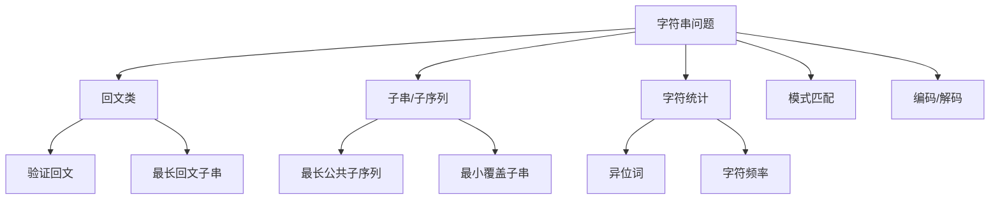

# 字符串：高频面试题型全解


## 一、字符串基础

**字符串**是由字符组成的有限序列，是面试中出现频率最高的数据类型之一。

### Java 中的字符串

| 类 | 特点 | 适用场景 |
|------|------|----------|
| `String` | 不可变 | 少量操作 |
| `StringBuilder` | 可变，非线程安全 | 频繁拼接 |
| `StringBuffer` | 可变，线程安全 | 多线程拼接 |

> **面试必知**：Java `String` 不可变，每次修改都创建新对象。频繁修改必须用 `StringBuilder`。

### 常用操作复杂度

| 操作 | String | StringBuilder |
|------|--------|---------------|
| 拼接 | O(n)（新建对象） | O(1) 均摊 |
| charAt(i) | O(1) | O(1) |
| substring | O(n)（Java 7+） | — |
| indexOf | O(nm) | O(nm) |

## 二、经典题型分类



## 三、回文问题

### 3.1 验证回文串

```java tab
public boolean isPalindrome(String s) {
    int left = 0, right = s.length() - 1;
    while (left < right) {
        while (left < right && !Character.isLetterOrDigit(s.charAt(left))) left++;
        while (left < right && !Character.isLetterOrDigit(s.charAt(right))) right--;
        if (Character.toLowerCase(s.charAt(left)) != Character.toLowerCase(s.charAt(right)))
            return false;
        left++;
        right--;
    }
    return true;
}
```

```typescript tab
function isPalindrome(s: string): boolean {
    let left = 0, right = s.length - 1;
    while (left < right) {
        while (left < right && !/[a-zA-Z0-9]/.test(s[left])) left++;
        while (left < right && !/[a-zA-Z0-9]/.test(s[right])) right--;
        if (s[left].toLowerCase() !== s[right].toLowerCase()) return false;
        left++;
        right--;
    }
    return true;
}
```

```python tab
def is_palindrome(s: str) -> bool:
    left, right = 0, len(s) - 1
    while left < right:
        while left < right and not s[left].isalnum():
            left += 1
        while left < right and not s[right].isalnum():
            right -= 1
        if s[left].lower() != s[right].lower():
            return False
        left += 1
        right -= 1
    return True
```

### 3.2 最长回文子串（中心扩展法）

```java tab
public String longestPalindrome(String s) {
    int start = 0, maxLen = 0;
    for (int i = 0; i < s.length(); i++) {
        int len1 = expand(s, i, i);       // 奇数长度
        int len2 = expand(s, i, i + 1);   // 偶数长度
        int len = Math.max(len1, len2);
        if (len > maxLen) {
            maxLen = len;
            start = i - (len - 1) / 2;
        }
    }
    return s.substring(start, start + maxLen);
}

private int expand(String s, int left, int right) {
    while (left >= 0 && right < s.length() && s.charAt(left) == s.charAt(right)) {
        left--;
        right++;
    }
    return right - left - 1;
}
```

```typescript tab
function longestPalindrome(s: string): string {
    const expand = (l: number, r: number): string => {
        while (l >= 0 && r < s.length && s[l] === s[r]) { l--; r++; }
        return s.slice(l + 1, r);
    };
    let res = "";
    for (let i = 0; i < s.length; i++) {
        const s1 = expand(i, i);
        const s2 = expand(i, i + 1);
        res = s1.length > res.length ? s1 : res;
        res = s2.length > res.length ? s2 : res;
    }
    return res;
}
```

```python tab
def longest_palindrome(s: str) -> str:
    def expand(left, right):
        while left >= 0 and right < len(s) and s[left] == s[right]:
            left -= 1
            right += 1
        return s[left + 1:right]

    res = ""
    for i in range(len(s)):
        s1 = expand(i, i)
        s2 = expand(i, i + 1)
        res = max(res, s1, s2, key=len)
    return res
```

- **时间**：O(n²)，**空间**：O(1)
- **进阶**：Manacher 算法可达 O(n)

## 四、字符统计与异位词

### 4.1 有效异位词

```java tab
public boolean isAnagram(String s, String t) {
    if (s.length() != t.length()) return false;
    int[] count = new int[26];
    for (int i = 0; i < s.length(); i++) {
        count[s.charAt(i) - 'a']++;
        count[t.charAt(i) - 'a']--;
    }
    for (int c : count) {
        if (c != 0) return false;
    }
    return true;
}
```

```typescript tab
function isAnagram(s: string, t: string): boolean {
    if (s.length !== t.length) return false;
    const count = new Array(26).fill(0);
    for (let i = 0; i < s.length; i++) {
        count[s.charCodeAt(i) - 97]++;
        count[t.charCodeAt(i) - 97]--;
    }
    return count.every(c => c === 0);
}
```

```python tab
def is_anagram(s: str, t: str) -> bool:
    if len(s) != len(t):
        return False
    count = [0] * 26
    for i in range(len(s)):
        count[ord(s[i]) - ord('a')] += 1
        count[ord(t[i]) - ord('a')] -= 1
    return all(c == 0 for c in count)
```

### 4.2 找所有异位词（滑动窗口）

```java tab
public List<Integer> findAnagrams(String s, String p) {
    List<Integer> res = new ArrayList<>();
    int[] need = new int[26], window = new int[26];
    for (char c : p.toCharArray()) need[c - 'a']++;

    int left = 0, valid = 0;
    for (int right = 0; right < s.length(); right++) {
        int r = s.charAt(right) - 'a';
        window[r]++;
        if (window[r] <= need[r]) valid++;

        if (right - left + 1 > p.length()) {
            int l = s.charAt(left) - 'a';
            if (window[l] <= need[l]) valid--;
            window[l]--;
            left++;
        }
        if (valid == p.length()) res.add(left);
    }
    return res;
}
```

```typescript tab
function findAnagrams(s: string, p: string): number[] {
    const res: number[] = [];
    const need = new Array(26).fill(0), window = new Array(26).fill(0);
    for (const c of p) need[c.charCodeAt(0) - 97]++;

    let left = 0, valid = 0;
    for (let right = 0; right < s.length; right++) {
        const r = s.charCodeAt(right) - 97;
        window[r]++;
        if (window[r] <= need[r]) valid++;

        if (right - left + 1 > p.length) {
            const l = s.charCodeAt(left) - 97;
            if (window[l] <= need[l]) valid--;
            window[l]--;
            left++;
        }
        if (valid === p.length) res.push(left);
    }
    return res;
}
```

```python tab
def find_anagrams(s: str, p: str) -> list:
    res = []
    need = [0] * 26
    window = [0] * 26
    for c in p:
        need[ord(c) - ord('a')] += 1

    left, valid = 0, 0
    for right in range(len(s)):
        r = ord(s[right]) - ord('a')
        window[r] += 1
        if window[r] <= need[r]:
            valid += 1

        if right - left + 1 > len(p):
            l = ord(s[left]) - ord('a')
            if window[l] <= need[l]:
                valid -= 1
            window[l] -= 1
            left += 1
        if valid == len(p):
            res.append(left)
    return res
```

## 五、子串与子序列

### 5.1 最长公共子序列（LCS）

```java tab
public int longestCommonSubsequence(String text1, String text2) {
    int m = text1.length(), n = text2.length();
    int[][] dp = new int[m + 1][n + 1];
    for (int i = 1; i <= m; i++) {
        for (int j = 1; j <= n; j++) {
            if (text1.charAt(i - 1) == text2.charAt(j - 1)) {
                dp[i][j] = dp[i - 1][j - 1] + 1;
            } else {
                dp[i][j] = Math.max(dp[i - 1][j], dp[i][j - 1]);
            }
        }
    }
    return dp[m][n];
}
```

```typescript tab
function longestCommonSubsequence(text1: string, text2: string): number {
    const m = text1.length, n = text2.length;
    const dp: number[][] = Array.from({ length: m + 1 }, () => new Array(n + 1).fill(0));
    for (let i = 1; i <= m; i++) {
        for (let j = 1; j <= n; j++) {
            if (text1[i - 1] === text2[j - 1]) {
                dp[i][j] = dp[i - 1][j - 1] + 1;
            } else {
                dp[i][j] = Math.max(dp[i - 1][j], dp[i][j - 1]);
            }
        }
    }
    return dp[m][n];
}
```

```python tab
def longest_common_subsequence(text1: str, text2: str) -> int:
    m, n = len(text1), len(text2)
    dp = [[0] * (n + 1) for _ in range(m + 1)]
    for i in range(1, m + 1):
        for j in range(1, n + 1):
            if text1[i - 1] == text2[j - 1]:
                dp[i][j] = dp[i - 1][j - 1] + 1
            else:
                dp[i][j] = max(dp[i - 1][j], dp[i][j - 1])
    return dp[m][n]
```

### 5.2 编辑距离

```java tab
public int minDistance(String word1, String word2) {
    int m = word1.length(), n = word2.length();
    int[][] dp = new int[m + 1][n + 1];
    for (int i = 0; i <= m; i++) dp[i][0] = i;
    for (int j = 0; j <= n; j++) dp[0][j] = j;

    for (int i = 1; i <= m; i++) {
        for (int j = 1; j <= n; j++) {
            if (word1.charAt(i - 1) == word2.charAt(j - 1)) {
                dp[i][j] = dp[i - 1][j - 1];
            } else {
                dp[i][j] = 1 + Math.min(dp[i - 1][j - 1],
                               Math.min(dp[i - 1][j], dp[i][j - 1]));
            }
        }
    }
    return dp[m][n];
}
```

```typescript tab
function minDistance(word1: string, word2: string): number {
    const m = word1.length, n = word2.length;
    const dp: number[][] = Array.from({ length: m + 1 }, () => new Array(n + 1).fill(0));
    for (let i = 0; i <= m; i++) dp[i][0] = i;
    for (let j = 0; j <= n; j++) dp[0][j] = j;

    for (let i = 1; i <= m; i++) {
        for (let j = 1; j <= n; j++) {
            if (word1[i - 1] === word2[j - 1]) {
                dp[i][j] = dp[i - 1][j - 1];
            } else {
                dp[i][j] = 1 + Math.min(dp[i - 1][j - 1], dp[i - 1][j], dp[i][j - 1]);
            }
        }
    }
    return dp[m][n];
}
```

```python tab
def min_distance(word1: str, word2: str) -> int:
    m, n = len(word1), len(word2)
    dp = [[0] * (n + 1) for _ in range(m + 1)]
    for i in range(m + 1):
        dp[i][0] = i
    for j in range(n + 1):
        dp[0][j] = j

    for i in range(1, m + 1):
        for j in range(1, n + 1):
            if word1[i - 1] == word2[j - 1]:
                dp[i][j] = dp[i - 1][j - 1]
            else:
                dp[i][j] = 1 + min(dp[i - 1][j - 1], dp[i - 1][j], dp[i][j - 1])
    return dp[m][n]
```

- **三种操作**：插入、删除、替换
- **时间**：O(mn)，**空间**：O(mn)，可优化为 O(n)

## 六、字符串常用技巧

| 技巧 | 场景 | 示例 |
|------|------|------|
| 双指针 | 回文、反转 | 验证回文串 |
| 滑动窗口 | 子串问题 | 最小覆盖子串 |
| 字符计数 | 异位词、频率 | 26 位数组 |
| DP | 子序列、编辑距离 | LCS、编辑距离 |
| 哈希 | 快速查找 | 罗马数字转整数 |
| StringBuilder | 高效拼接 | 字符串压缩 |

### 字符串压缩

```java tab
public String compress(String s) {
    StringBuilder sb = new StringBuilder();
    int count = 1;
    for (int i = 1; i <= s.length(); i++) {
        if (i < s.length() && s.charAt(i) == s.charAt(i - 1)) {
            count++;
        } else {
            sb.append(s.charAt(i - 1));
            if (count > 1) sb.append(count);
            count = 1;
        }
    }
    return sb.length() < s.length() ? sb.toString() : s;
}
```

```typescript tab
function compress(s: string): string {
    let result = "";
    let count = 1;
    for (let i = 1; i <= s.length; i++) {
        if (i < s.length && s[i] === s[i - 1]) {
            count++;
        } else {
            result += s[i - 1];
            if (count > 1) result += count;
            count = 1;
        }
    }
    return result.length < s.length ? result : s;
}
```

```python tab
def compress(s: str) -> str:
    result = []
    count = 1
    for i in range(1, len(s) + 1):
        if i < len(s) and s[i] == s[i - 1]:
            count += 1
        else:
            result.append(s[i - 1])
            if count > 1:
                result.append(str(count))
            count = 1
    compressed = ''.join(result)
    return compressed if len(compressed) < len(s) else s
```

## 七、面试常见题

- 🟢 反转字符串、有效异位词、验证回文、最长公共前缀
- 🟡 最长回文子串、字符串的排列、分组异位词
- 🟠 最小覆盖子串、编辑距离、通配符匹配
- 🔴 正则表达式匹配、最短回文串、串联所有单词的子串

## 八、调试技巧

1. **下标对齐**：DP 中 `dp[i][j]` 对应 `s.charAt(i-1)` 和 `t.charAt(j-1)`。
2. **空串处理**：`s.length() == 0` 时直接返回。
3. **大小写**：统一转为小写再比较。
4. **StringBuilder 反转**：`sb.reverse()` 比手动反转简洁。
