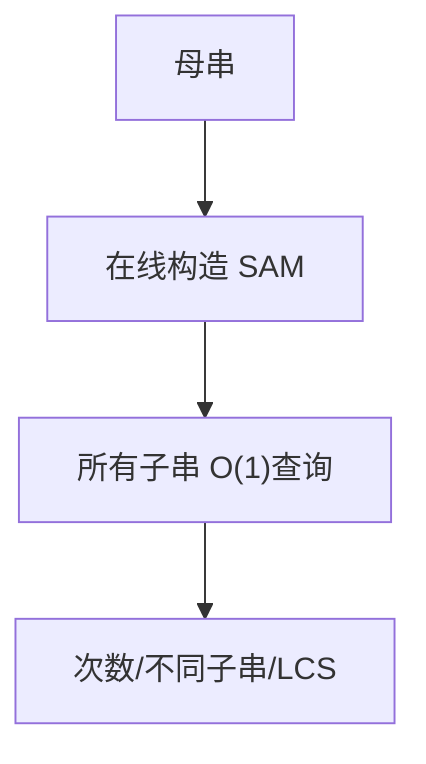

# 后缀自动机（Suffix Automaton, SAM）

## 一、为什么学后缀自动机？



后缀自动机是处理**字符串子串**问题的最强工具之一，能在线性空间内表示字符串的所有子串：

- 判断子串是否存在（O(|T|)）
- 统计某子串出现次数 / 不同子串个数
- 最长公共子串（LCS）
- 后缀数组、后缀树的轻量替代

对比：KMP 解决"模式匹配"，而 SAM 解决"关于母串所有子串的查询"。

## 二、核心概念

- **状态 (state)**：代表一组 endpos 等价（在母串中结束位置集合相同）的子串
- **转移 (trans)**：字符 → 下一状态
- **link (后缀链接)**：指向"代表当前状态所有子串的最长后缀、且 endpos 更大的状态"
- **len**：状态代表的最长子串长度

关键性质：不同状态数 ≤ 2n−1，转移数 ≤ 3n−4，均为 O(n)。

## 三、在线构造（逐字符添加）

```java tab
class State {
    int len, link;
    int[] next = new int[26];
    State() { Arrays.fill(next, -1); link = -1; }
}
State[] st = new State[2 * N];
int sz, last;
void saInit() { st[0] = new State(); sz = 1; last = 0; }
void saExtend(char c) {
    int cur = sz++; st[cur] = new State();
    st[cur].len = st[last].len + 1;
    int p = last;
    while (p != -1 && st[p].next[c - 'a'] == -1) {
        st[p].next[c - 'a'] = cur; p = st[p].link;
    }
    if (p == -1) st[cur].link = 0;
    else {
        int q = st[p].next[c - 'a'];
        if (st[p].len + 1 == st[q].len) st[cur].link = q;
        else {
            int clone = sz++; st[clone] = new State();
            st[clone].len = st[p].len + 1;
            st[clone].link = st[q].link;
            System.arraycopy(st[q].next, 0, st[clone].next, 0, 26);
            while (p != -1 && st[p].next[c - 'a'] == q) {
                st[p].next[c - 'a'] = clone; p = st[p].link;
            }
            st[q].link = st[cur].link = clone;
        }
    }
    last = cur;
}
```

```typescript tab
class State {
    len = 0; link = -1;
    next: number[] = new Array(26).fill(-1);
}
const st: State[] = [];
let sz = 0, last = 0;
function saInit() { st.length = 0; st.push(new State()); sz = 1; last = 0; }
function saExtend(c: string) {
    const cur = sz++; st.push(new State());
    st[cur].len = st[last].len + 1;
    let p = last;
    const idx = c.charCodeAt(0) - 97;
    while (p !== -1 && st[p].next[idx] === -1) {
        st[p].next[idx] = cur; p = st[p].link;
    }
    if (p === -1) st[cur].link = 0;
    else {
        const q = st[p].next[idx];
        if (st[p].len + 1 === st[q].len) st[cur].link = q;
        else {
            const clone = sz++; st.push(new State());
            st[clone].len = st[p].len + 1;
            st[clone].link = st[q].link;
            st[clone].next = [...st[q].next];
            while (p !== -1 && st[p].next[idx] === q) {
                st[p].next[idx] = clone; p = st[p].link;
            }
            st[q].link = st[cur].link = clone;
        }
    }
    last = cur;
}
```

```python tab
class State:
    def __init__(self):
        self.len = 0
        self.link = -1
        self.next = [-1] * 26

st: list[State] = []
sz = last = 0
def sa_init():
    global sz, last
    st.clear()
    st.append(State())
    sz = 1
    last = 0
def sa_extend(c: str):
    global sz, last
    cur = sz; sz += 1
    st.append(State())
    st[cur].len = st[last].len + 1
    p = last
    idx = ord(c) - 97
    while p != -1 and st[p].next[idx] == -1:
        st[p].next[idx] = cur
        p = st[p].link
    if p == -1:
        st[cur].link = 0
    else:
        q = st[p].next[idx]
        if st[p].len + 1 == st[q].len:
            st[cur].link = q
        else:
            clone = sz; sz += 1
            st.append(State())
            st[clone].len = st[p].len + 1
            st[clone].link = st[q].link
            st[clone].next = st[q].next[:]
            while p != -1 and st[p].next[idx] == q:
                st[p].next[idx] = clone
                p = st[p].link
            st[q].link = st[cur].link = clone
    last = cur
```

## 四、典型应用

### 4.1 不同子串个数
沿后缀链接构成 DAG，`cnt[v] = 1 + Σ cnt[to]`，不同子串数 = `Σ (len[v] − len[link[v]])`。

### 4.2 子串出现次数
拓扑序从长到短累加：`cnt[link[v]] += cnt[v]`，初始每个前缀状态 `cnt=1`。

### 4.3 最长公共子串（两串）
在 S 的 SAM 上用 T 匹配：能延伸则 len++，否则沿 link 回退。

## 五、复杂度

| 项目 | 复杂度 |
|------|--------|
| 构造时间 | O(n) |
| 状态数 | ≤ 2n−1 |
| 转移数 | ≤ 3n−4 |
| 子串查询 | O(|T|) |

## 六、面试要点

1. SAM 空间线性，是后缀树的压缩形态
2. 后缀链接 link 构成一棵树，父节点的 endpos 真包含子节点
3. 不同子串数、出现次数都靠"len 差 + 拓扑累加"
4. LeetCode：1044 最长重复子串、多串 LCS 常用 SAM
