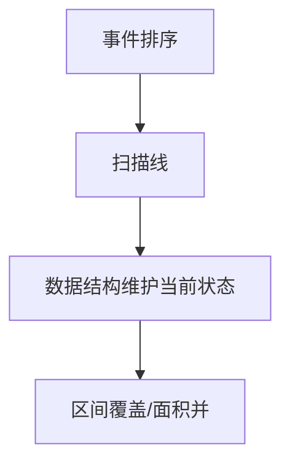

# 扫描线算法

扫描线（Sweep Line）是一种将二维问题降为一维的经典思想：用一条线沿某方向扫过平面，在扫描过程中用数据结构维护当前状态，高效处理区间覆盖、面积并等问题。

## 一、核心思想



1. 将所有事件（开始/结束）按坐标排序
2. 用一条"线"从左到右（或从下到上）扫描
3. 在扫描过程中维护活跃集合（通常用线段树/优先队列）
4. 在每个事件点更新答案

## 二、矩形面积并（LeetCode 850）

### 思路

1. 将每个矩形拆成两条竖边事件：(x, y1, y2, +1) 和 (x, y1, y2, -1)
2. 按 x 排序
3. 扫描时用线段树维护 y 方向的覆盖长度
4. 面积 += 覆盖长度 × Δx

```java tab
int rectangleArea(int[][] rectangles) {
    int MOD = 1_000_000_007;
    List<int[]> events = new ArrayList<>(); // {x, y1, y2, type}
    Set<Integer> ySet = new TreeSet<>();

    for (int[] r : rectangles) {
        events.add(new int[]{r[0], r[1], r[3], 1});  // 左边 +1
        events.add(new int[]{r[2], r[1], r[3], -1}); // 右边 -1
        ySet.add(r[1]); ySet.add(r[3]);
    }

    events.sort((a, b) -> a[0] - b[0]);
    int[] ys = ySet.stream().mapToInt(Integer::intValue).toArray();
    int m = ys.length - 1;
    int[] count = new int[m]; // 每段被覆盖次数

    long area = 0;
    int prevX = events.get(0)[0];

    for (int[] event : events) {
        int x = event[0], y1 = event[1], y2 = event[2], type = event[3];
        // 累加面积
        int coveredLen = 0;
        for (int i = 0; i < m; i++) {
            if (count[i] > 0) coveredLen += ys[i+1] - ys[i];
        }
        area = (area + (long)coveredLen * (x - prevX)) % MOD;
        prevX = x;

        // 更新覆盖
        int lo = Arrays.binarySearch(ys, y1);
        int hi = Arrays.binarySearch(ys, y2);
        for (int i = lo; i < hi; i++) count[i] += type;
    }
    return (int) area;
}
```

```typescript tab
function rectangleArea(rectangles: number[][]): number {
    const MOD = 1000000007n;
    const events: number[][] = []; // {x, y1, y2, type}
    const ySet = new Set<number>();

    for (const r of rectangles) {
        events.push([r[0], r[1], r[3], 1]);  // 左边 +1
        events.push([r[2], r[1], r[3], -1]); // 右边 -1
        ySet.add(r[1]); ySet.add(r[3]);
    }

    events.sort((a, b) => a[0] - b[0]);
    const ys = [...ySet].sort((a, b) => a - b);
    const m = ys.length - 1;
    const count = new Array(m).fill(0); // 每段被覆盖次数

    let area = 0n;
    let prevX = events[0][0];

    for (const [x, y1, y2, type] of events) {
        // 累加面积
        let coveredLen = 0;
        for (let i = 0; i < m; i++) {
            if (count[i] > 0) coveredLen += ys[i + 1] - ys[i];
        }
        area = (area + BigInt(coveredLen) * BigInt(x - prevX)) % MOD;
        prevX = x;

        // 更新覆盖
        const lo = ys.indexOf(y1);
        const hi = ys.indexOf(y2);
        for (let i = lo; i < hi; i++) count[i] += type;
    }
    return Number(area);
}
```

```python tab
def rectangle_area(rectangles: list) -> int:
    MOD = 10**9 + 7
    events = []  # (x, y1, y2, type)
    y_set = set()

    for r in rectangles:
        events.append((r[0], r[1], r[3], 1))   # 左边 +1
        events.append((r[2], r[1], r[3], -1))  # 右边 -1
        y_set.add(r[1])
        y_set.add(r[3])

    events.sort(key=lambda e: e[0])
    ys = sorted(y_set)
    m = len(ys) - 1
    count = [0] * m  # 每段被覆盖次数

    area = 0
    prev_x = events[0][0]

    for x, y1, y2, typ in events:
        # 累加面积
        covered_len = sum(ys[i + 1] - ys[i] for i in range(m) if count[i] > 0)
        area = (area + covered_len * (x - prev_x)) % MOD
        prev_x = x

        # 更新覆盖
        lo = ys.index(y1)
        hi = ys.index(y2)
        for i in range(lo, hi):
            count[i] += typ
    return area
```

## 三、天际线问题（LeetCode 218）

### 思路

1. 建筑拆成 (left, -height) 和 (right, height) 事件
2. 按 x 排序（同 x 时高度特殊处理）
3. 用 TreeMap（或优先队列）维护当前最大高度
4. 最大高度变化时产生关键点

```java tab
List<List<Integer>> getSkyline(int[][] buildings) {
    List<int[]> events = new ArrayList<>();
    for (int[] b : buildings) {
        events.add(new int[]{b[0], -b[2]}); // 进入（负高度）
        events.add(new int[]{b[1], b[2]});  // 离开
    }
    events.sort((a, b) -> a[0] != b[0] ? a[0] - b[0] : a[1] - b[1]);

    TreeMap<Integer, Integer> heights = new TreeMap<>();
    heights.put(0, 1);
    List<List<Integer>> result = new ArrayList<>();
    int prevMax = 0;

    for (int[] e : events) {
        int h = Math.abs(e[1]);
        if (e[1] < 0) { // 进入
            heights.merge(h, 1, Integer::sum);
        } else { // 离开
            if (heights.get(h) == 1) heights.remove(h);
            else heights.merge(h, -1, Integer::sum);
        }
        int curMax = heights.lastKey();
        if (curMax != prevMax) {
            result.add(List.of(e[0], curMax));
            prevMax = curMax;
        }
    }
    return result;
}
```

```typescript tab
function getSkyline(buildings: number[][]): number[][] {
    const events: number[][] = [];
    for (const b of buildings) {
        events.push([b[0], -b[2]]); // 进入（负高度）
        events.push([b[1], b[2]]);  // 离开
    }
    events.sort((a, b) => a[0] !== b[0] ? a[0] - b[0] : a[1] - b[1]);

    const heights = new Map<number, number>(); // 有序映射（简化）
    heights.set(0, 1);
    const result: number[][] = [];
    let prevMax = 0;

    for (const [x, eh] of events) {
        const h = Math.abs(eh);
        if (eh < 0) { // 进入
            heights.set(h, (heights.get(h) || 0) + 1);
        } else { // 离开
            const cnt = heights.get(h)!;
            if (cnt === 1) heights.delete(h);
            else heights.set(h, cnt - 1);
        }
        const curMax = Math.max(...heights.keys());
        if (curMax !== prevMax) {
            result.push([x, curMax]);
            prevMax = curMax;
        }
    }
    return result;
}
```

```python tab
from sortedcontainers import SortedDict

def get_skyline(buildings: list) -> list:
    events = []
    for b in buildings:
        events.append((b[0], -b[2]))  # 进入（负高度）
        events.append((b[1], b[2]))   # 离开
    events.sort()

    heights = SortedDict({0: 1})
    result = []
    prev_max = 0

    for x, eh in events:
        h = abs(eh)
        if eh < 0:  # 进入
            heights[h] = heights.get(h, 0) + 1
        else:  # 离开
            if heights[h] == 1:
                del heights[h]
            else:
                heights[h] -= 1
        cur_max = heights.keys()[-1]
        if cur_max != prev_max:
            result.append([x, cur_max])
            prev_max = cur_max
    return result
```

## 四、其他应用

| 问题 | 扫描方向 | 数据结构 |
|------|---------|---------|
| 矩形面积并 | x 方向 | 线段树（y 覆盖） |
| 天际线 | x 方向 | TreeMap / 堆 |
| 线段相交 | x 方向 | 平衡 BST |
| 最近点对 | x 方向 | 有序集合 |
| 区间调度 | 时间 | 优先队列 |

## 五、复杂度

| 问题 | 时间 |
|------|------|
| 矩形面积并（暴力） | O(n²) |
| 矩形面积并（线段树） | O(n log n) |
| 天际线 | O(n log n) |

## 六、面试要点

1. **事件拆分**：每个对象拆成进入/离开两个事件
2. **排序**：按扫描坐标排序
3. **维护活跃集**：堆/TreeMap/线段树
4. **面积累加**：覆盖长度 × Δx
5. **LeetCode**：218（天际线）、850（矩形面积 II）、253（会议室 II）
