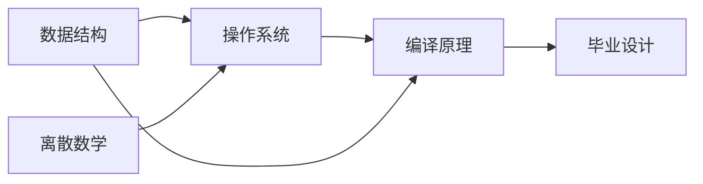

# 拓扑排序：DAG 上的线性化


## 一、什么是拓扑排序

**拓扑排序（Topological Sort）** 对有向无环图（DAG）的顶点排成线性序列，使得对每条有向边 `(u, v)`，u 都排在 v 前面。

> 典型应用：课程先修关系、编译依赖、任务调度。



> 合法拓扑序之一：数据结构 → 离散数学 → 操作系统 → 编译原理 → 毕业设计

**前提**：图必须是 **DAG**（无环）。有环则不存在拓扑序。

## 二、两种实现方式

### 2.1 BFS（Kahn 算法）

不断删除入度为 0 的节点：

```java tab
public int[] topologicalSort(int n, int[][] edges) {
    List<Integer>[] graph = new ArrayList[n];
    int[] inDegree = new int[n];
    for (int i = 0; i < n; i++) graph[i] = new ArrayList<>();

    for (int[] e : edges) {
        graph[e[0]].add(e[1]);
        inDegree[e[1]]++;
    }

    Queue<Integer> queue = new LinkedList<>();
    for (int i = 0; i < n; i++) {
        if (inDegree[i] == 0) queue.offer(i);
    }

    int[] order = new int[n];
    int idx = 0;
    while (!queue.isEmpty()) {
        int u = queue.poll();
        order[idx++] = u;
        for (int v : graph[u]) {
            inDegree[v]--;
            if (inDegree[v] == 0) queue.offer(v);
        }
    }

    // idx < n 说明有环
    return idx == n ? order : new int[0];
}
```

```typescript tab
function topologicalSort(n: number, edges: number[][]): number[] {
    const graph: number[][] = Array.from({ length: n }, () => []);
    const inDegree = new Array(n).fill(0);

    for (const [u, v] of edges) {
        graph[u].push(v);
        inDegree[v]++;
    }

    const queue: number[] = [];
    for (let i = 0; i < n; i++) {
        if (inDegree[i] === 0) queue.push(i);
    }

    const order: number[] = [];
    while (queue.length) {
        const u = queue.shift()!;
        order.push(u);
        for (const v of graph[u]) {
            inDegree[v]--;
            if (inDegree[v] === 0) queue.push(v);
        }
    }

    // order.length < n 说明有环
    return order.length === n ? order : [];
}
```

```python tab
from collections import deque

def topological_sort(n: int, edges: list[list[int]]) -> list[int]:
    graph = [[] for _ in range(n)]
    in_degree = [0] * n

    for u, v in edges:
        graph[u].append(v)
        in_degree[v] += 1

    queue = deque(i for i in range(n) if in_degree[i] == 0)

    order = []
    while queue:
        u = queue.popleft()
        order.append(u)
        for v in graph[u]:
            in_degree[v] -= 1
            if in_degree[v] == 0:
                queue.append(v)

    # len(order) < n 说明有环
    return order if len(order) == n else []
```

- **时间**：O(V + E)，**空间**：O(V + E)

### 2.2 DFS（后序反转）

DFS 完成时记录节点，最后反转：

```java tab
public int[] topologicalSortDFS(int n, int[][] edges) {
    List<Integer>[] graph = new ArrayList[n];
    for (int i = 0; i < n; i++) graph[i] = new ArrayList<>();
    for (int[] e : edges) graph[e[0]].add(e[1]);

    int[] state = new int[n];   // 0=未访问, 1=访问中, 2=已完成
    Deque<Integer> stack = new ArrayDeque<>();
    boolean[] hasCycle = {false};

    for (int i = 0; i < n; i++) {
        if (state[i] == 0) {
            dfs(graph, i, state, stack, hasCycle);
        }
    }
    if (hasCycle[0]) return new int[0];

    int[] order = new int[n];
    for (int i = 0; i < n; i++) order[i] = stack.pop();
    return order;
}

private void dfs(List<Integer>[] graph, int u, int[] state,
                 Deque<Integer> stack, boolean[] hasCycle) {
    state[u] = 1;
    for (int v : graph[u]) {
        if (state[v] == 1) { hasCycle[0] = true; return; }
        if (state[v] == 0) dfs(graph, v, state, stack, hasCycle);
    }
    state[u] = 2;
    stack.push(u);
}
```

```typescript tab
function topologicalSortDFS(n: number, edges: number[][]): number[] {
    const graph: number[][] = Array.from({ length: n }, () => []);
    for (const [u, v] of edges) graph[u].push(v);

    const state = new Array(n).fill(0); // 0=未访问, 1=访问中, 2=已完成
    const stack: number[] = [];
    let hasCycle = false;

    function dfs(u: number): void {
        state[u] = 1;
        for (const v of graph[u]) {
            if (state[v] === 1) { hasCycle = true; return; }
            if (state[v] === 0) dfs(v);
        }
        state[u] = 2;
        stack.push(u);
    }

    for (let i = 0; i < n; i++) {
        if (state[i] === 0) dfs(i);
    }
    if (hasCycle) return [];

    return stack.reverse();
}
```

```python tab
def topological_sort_dfs(n: int, edges: list[list[int]]) -> list[int]:
    graph = [[] for _ in range(n)]
    for u, v in edges:
        graph[u].append(v)

    state = [0] * n  # 0=未访问, 1=访问中, 2=已完成
    stack = []
    has_cycle = False

    def dfs(u: int) -> None:
        nonlocal has_cycle
        state[u] = 1
        for v in graph[u]:
            if state[v] == 1:
                has_cycle = True
                return
            if state[v] == 0:
                dfs(v)
        state[u] = 2
        stack.append(u)

    for i in range(n):
        if state[i] == 0:
            dfs(i)
    if has_cycle:
        return []

    return stack[::-1]
```

## 三、环检测

| 方法 | 判断依据 |
|------|----------|
| BFS（Kahn） | 处理完的节点数 < n → 有环 |
| DFS | 遇到"访问中"的节点 → 有环 |

## 四、经典应用

### 4.1 课程表（LeetCode 207/210）

**问题**：n 门课程，`prerequisites[i] = [a, b]` 表示学 a 前必须先学 b。能否完成所有课程？

```java tab
public boolean canFinish(int numCourses, int[][] prerequisites) {
    return topologicalSort(numCourses, prerequisites).length == numCourses;
}
```

```typescript tab
function canFinish(numCourses: number, prerequisites: number[][]): boolean {
    return topologicalSort(numCourses, prerequisites).length === numCourses;
}
```

```python tab
def can_finish(num_courses: int, prerequisites: list[list[int]]) -> bool:
    return len(topological_sort(num_courses, prerequisites)) == num_courses
```

### 4.2 外星文字典（LeetCode 269）

从排序的外星词表中推导字母顺序 → 建图 + 拓扑排序。

### 4.3 编译依赖 / 任务调度

```text
任务 A 依赖 B、C → 边 B→A, C→A
拓扑序 = 合法执行顺序
```

## 五、拓扑排序 + DP

在 DAG 上按拓扑序做动态规划：

**问题**：DAG 中的最长路径。

```java tab
public int longestPath(int n, int[][] edges, int[] weight) {
    List<int[]>[] graph = new ArrayList[n];
    int[] inDegree = new int[n];
    for (int i = 0; i < n; i++) graph[i] = new ArrayList<>();
    for (int[] e : edges) {
        graph[e[0]].add(new int[]{e[1], e[2]});
        inDegree[e[1]]++;
    }

    Queue<Integer> queue = new LinkedList<>();
    int[] dist = new int[n];
    for (int i = 0; i < n; i++) {
        if (inDegree[i] == 0) queue.offer(i);
    }

    while (!queue.isEmpty()) {
        int u = queue.poll();
        for (int[] edge : graph[u]) {
            int v = edge[0], w = edge[1];
            dist[v] = Math.max(dist[v], dist[u] + w);
            if (--inDegree[v] == 0) queue.offer(v);
        }
    }
    return Arrays.stream(dist).max().getAsInt();
}
```

```typescript tab
function longestPath(n: number, edges: number[][], weight: number[]): number {
    const graph: [number, number][][] = Array.from({ length: n }, () => []);
    const inDegree = new Array(n).fill(0);
    for (const [u, v, w] of edges) {
        graph[u].push([v, w]);
        inDegree[v]++;
    }

    const queue: number[] = [];
    const dist = new Array(n).fill(0);
    for (let i = 0; i < n; i++) {
        if (inDegree[i] === 0) queue.push(i);
    }

    while (queue.length) {
        const u = queue.shift()!;
        for (const [v, w] of graph[u]) {
            dist[v] = Math.max(dist[v], dist[u] + w);
            if (--inDegree[v] === 0) queue.push(v);
        }
    }
    return Math.max(...dist);
}
```

```python tab
def longest_path(n: int, edges: list[list[int]], weight: list[int]) -> int:
    graph = [[] for _ in range(n)]
    in_degree = [0] * n
    for u, v, w in edges:
        graph[u].append((v, w))
        in_degree[v] += 1

    queue = deque(i for i in range(n) if in_degree[i] == 0)
    dist = [0] * n

    while queue:
        u = queue.popleft()
        for v, w in graph[u]:
            dist[v] = max(dist[v], dist[u] + w)
            in_degree[v] -= 1
            if in_degree[v] == 0:
                queue.append(v)
    return max(dist)
```

## 六、BFS vs DFS 选择

| 维度 | BFS（Kahn） | DFS |
|------|------------|-----|
| 实现 | 直观（入度） | 递归（后序） |
| 环检测 | 计数 < n | 三色标记 |
| 多解 | 可用优先队列得字典序最小 | 取决于遍历顺序 |
| 适用 | 更常用 | 需要 DFS 序时 |

## 七、面试常见题

- 🟢 课程表 I（能否完成）
- 🟡 课程表 II（返回顺序）、外星文字典
- 🟠 并行课程（最少学期数）、序列重建
- 🔴 DAG 上最长路径、有向图强连通分量（Tarjan）

## 八、调试技巧

1. **建图方向**：`[a, b]` 表示 b→a（先修 b 才能学 a），别搞反。
2. **入度初始化**：确保所有边都统计到。
3. **环的判断**：BFS 结束后 `idx < n` 就是有环。
4. **多解**：题目若要求字典序最小，用 `PriorityQueue` 替代 `Queue`。
