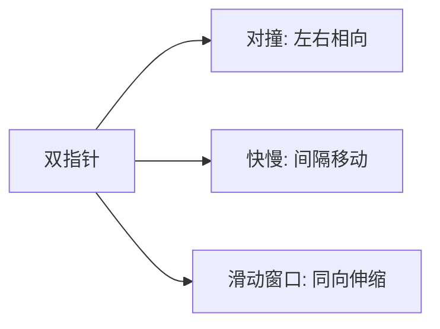

# 双指针技巧

双指针（Two Pointers）是解决**数组/链表**问题最优雅的技巧之一。通过两个指针的协同移动，将 O(n²) 暴力枚举优化为 O(n) 线性扫描。

## 一、双指针的三大模式



### 1. 对撞指针（左右相向）

两个指针从两端向中间靠拢，常用于有序数组。

```java tab
// 两数之和 II（有序数组）LeetCode 167
public int[] twoSum(int[] numbers, int target) {
    int left = 0, right = numbers.length - 1;
    while (left < right) {
        int sum = numbers[left] + numbers[right];
        if (sum == target) return new int[]{left + 1, right + 1};
        else if (sum < target) left++;
        else right--;
    }
    return new int[]{-1, -1};
}
```
```typescript tab
function twoSum(numbers: number[], target: number): number[] {
    let left = 0, right = numbers.length - 1;
    while (left < right) {
        const sum = numbers[left] + numbers[right];
        if (sum === target) return [left + 1, right + 1];
        else if (sum < target) left++;
        else right--;
    }
    return [-1, -1];
}
```
```python tab
def two_sum(numbers: list[int], target: int) -> list[int]:
    left, right = 0, len(numbers) - 1
    while left < right:
        s = numbers[left] + numbers[right]
        if s == target:
            return [left + 1, right + 1]
        elif s < target:
            left += 1
        else:
            right -= 1
    return [-1, -1]
```

### 2. 快慢指针（同向不同速）

两个指针同向移动，速度不同，常用于链表环检测。

```java tab
// 环形链表 II LeetCode 142
public ListNode detectCycle(ListNode head) {
    ListNode slow = head, fast = head;
    while (fast != null && fast.next != null) {
        slow = slow.next;
        fast = fast.next.next;
        if (slow == fast) {
            ListNode ptr = head;
            while (ptr != slow) {
                ptr = ptr.next;
                slow = slow.next;
            }
            return ptr;
        }
    }
    return null;
}
```
```typescript tab
function detectCycle(head: ListNode | null): ListNode | null {
    let slow = head, fast = head;
    while (fast && fast.next) {
        slow = slow!.next;
        fast = fast.next.next;
        if (slow === fast) {
            let ptr = head;
            while (ptr !== slow) {
                ptr = ptr!.next;
                slow = slow!.next;
            }
            return ptr;
        }
    }
    return null;
}
```
```python tab
def detect_cycle(head):
    slow = fast = head
    while fast and fast.next:
        slow = slow.next
        fast = fast.next.next
        if slow is fast:
            ptr = head
            while ptr is not slow:
                ptr = ptr.next
                slow = slow.next
            return ptr
    return None
```

### 3. 分离指针（同向同速，一前一后）

用于原地删除、去重、分区等操作。

```java tab
// 移除元素 LeetCode 27
public int removeElement(int[] nums, int val) {
    int slow = 0;
    for (int fast = 0; fast < nums.length; fast++) {
        if (nums[fast] != val) {
            nums[slow++] = nums[fast];
        }
    }
    return slow;
}
```
```typescript tab
function removeElement(nums: number[], val: number): number {
    let slow = 0;
    for (let fast = 0; fast < nums.length; fast++) {
        if (nums[fast] !== val) {
            nums[slow++] = nums[fast];
        }
    }
    return slow;
}
```
```python tab
def remove_element(nums: list[int], val: int) -> int:
    slow = 0
    for fast in range(len(nums)):
        if nums[fast] != val:
            nums[slow] = nums[fast]
            slow += 1
    return slow
```

## 二、经典题型速查

| 题目 | 模式 | 关键思路 |
|------|------|---------|
| 两数之和 II | 对撞 | 有序 → 和小左移，和大右移 |
| 三数之和 | 对撞 | 固定一个数 + 对撞 |
| 盛水最多的容器 | 对撞 | 移动较短的一侧 |
| 环形链表 | 快慢 | 快2慢1，相遇则有环 |
| 链表中点 | 快慢 | 快到尾，慢到中 |
| 移除元素 | 分离 | 快指针探索，慢指针写入 |
| 删除有序数组重复项 | 分离 | 不等则写入 |
| 颜色分类（荷兰国旗） | 三指针 | lt/gt/i 三路分区 |

## 三、荷兰国旗问题（三指针）

```java tab
// 颜色分类 LeetCode 75
public void sortColors(int[] nums) {
    int lt = 0;
    int gt = nums.length;
    int i = 0;
    while (i < gt) {
        if (nums[i] == 0) {
            swap(nums, i, lt);
            lt++; i++;
        } else if (nums[i] == 2) {
            gt--;
            swap(nums, i, gt);
        } else {
            i++;
        }
    }
}
```
```typescript tab
function sortColors(nums: number[]): void {
    let lt = 0, gt = nums.length, i = 0;
    while (i < gt) {
        if (nums[i] === 0) {
            [nums[i], nums[lt]] = [nums[lt], nums[i]];
            lt++; i++;
        } else if (nums[i] === 2) {
            gt--;
            [nums[i], nums[gt]] = [nums[gt], nums[i]];
        } else {
            i++;
        }
    }
}
```
```python tab
def sort_colors(nums: list[int]) -> None:
    lt, gt, i = 0, len(nums), 0
    while i < gt:
        if nums[i] == 0:
            nums[i], nums[lt] = nums[lt], nums[i]
            lt += 1; i += 1
        elif nums[i] == 2:
            gt -= 1
            nums[i], nums[gt] = nums[gt], nums[i]
        else:
            i += 1
```

## 四、双指针正确性证明

对撞指针的核心不变量：**被跳过的组合一定不是答案**。

以"盛水最多的容器"为例：
- 面积 = min(h[l], h[r]) × (r - l)
- 移动较高的一侧：宽度减小，高度不可能增加 → 面积必然减小
- 所以只能移动较低的一侧，才可能找到更大面积

## 五、面试要点

1. **看到“有序数组 + 两数/三数之和”→ 对撞指针**
2. **看到“链表环/中点”→ 快慢指针**
3. **看到“原地修改数组”→ 分离指针（快慢同向）**
4. **时间复杂度**：所有双指针都是 O(n)，因为每个指针最多移动 n 次
5. **与滑动窗口的区别**：滑动窗口是双指针的特例，窗口内维护聚合状态

## 六、对撞指针过程图解

以“有序数组两数之和”（target=9, nums=[2,7,11,15]）为例：

```
初始:  l=0, r=3
[2, 7, 11, 15]   sum = 2+15 = 17 > 9 → r--
 l        r

[2, 7, 11, 15]   sum = 2+11 = 13 > 9 → r--
 l     r

[2, 7, 11, 15]   sum = 2+7 = 9 == 9 → 找到！[0,1]
 l  r

为什么不需要回头？
对撞指针不变量：sum > target → r--（右端太大）；sum < target → l++（左端太小）。
当 l=0,r=3 时只考察了 (0,3)，sum=17>target 所以 r--；此后 (0,2) 只会更小。
```

## 七、面试真题

| 题目 | 难度 | 模式 | 核心思路 |
|------|------|------|----------|
| 两数之和 II（LC 167） | 🟡 Medium | 对撞 | 有序数组，sum 大了 r--，小了 l++ |
| 盛水最多的容器（LC 11） | 🟡 Medium | 对撞 | 移动较矮的一侧 |
| 三数之和（LC 15） | 🟡 Medium | 对撞 | 排序 + 固定一个数 + 对撞 + 去重 |
| 删除有序数组重复项（LC 26） | 🟢 Easy | 分离 | 快指针探索，慢指针写入 |
| 移动零（LC 283） | 🟢 Easy | 分离 | 非零元素前移 |
| 环形链表（LC 141） | 🟢 Easy | 快慢 | 快2慢1，相遇即有环 |
| 链表中点（LC 876） | 🟢 Easy | 快慢 | 快指针到尾，慢指针到中 |
| 接雨水（LC 42） | 🔴 Hard | 对撞 | 左右最大值中较小的决定水量 |

## 八、易错点分析

**1. 循环条件写错**

```java
// 对撞指针：✅ while (l < r)，❌ while (l <= r)（三数之和中会重复计算）
// 快慢指针：✅ while (fast != null && fast.next != null)
```

**2. 三数之和忘记去重**

```java
// ❌ 只去重内层，外层 nums[i] == nums[i-1] 时也要跳过
if (i > 0 && nums[i] == nums[i - 1]) continue;
// 内层找到解后：
while (l < r && nums[l] == nums[l + 1]) l++;
while (l < r && nums[r] == nums[r - 1]) r--;
```

**3. 快慢指针找中点的奇偶差异**

```
[1,2,3,4]: fast=head 时 slow 停在 3（偏右中点）
           fast=head.next 时 slow 停在 2（偏左中点）
链表归并排序必须用偏左中点，否则两个节点时死循环
```

## 九、思考题

1. 为什么对撞指针只移动较矮的一侧是正确的？如果移动较高的一侧，会错过什么？
2. 快慢指针检测环时，快指针每次走 3 步而不是 2 步，还能保证相遇吗？（提示：相对速度与环长的关系）
3. LC 42 接雨水用对撞指针时，为什么比较的是 leftMax 和 rightMax 而不是 h[l] 和 h[r]？

> 练习推荐：按 LC 167 → LC 11 → LC 15 的顺序练习对撞指针，再刷快慢指针专题。
