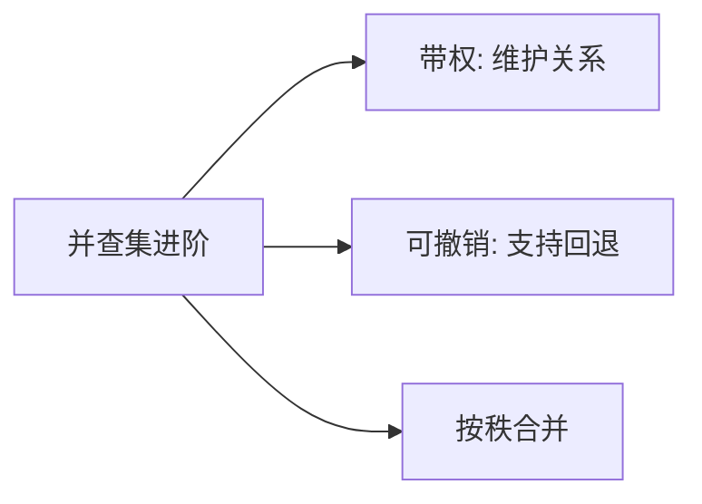

# 并查集进阶

并查集在基础的合并与查询之上，还可以扩展为带权并查集（维护节点间关系）、可撤销并查集（支持回退）和按秩合并优化。本篇覆盖进阶用法与经典应用。

## 一、基础回顾



```java tab
int[] parent, rank;

void init(int n) {
    parent = new int[n]; rank = new int[n];
    for (int i = 0; i < n; i++) parent[i] = i;
}

int find(int x) {
    if (parent[x] != x) parent[x] = find(parent[x]); // 路径压缩
    return parent[x];
}

void union(int x, int y) {
    int rx = find(x), ry = find(y);
    if (rx == ry) return;
    if (rank[rx] < rank[ry]) { int t = rx; rx = ry; ry = t; }
    parent[ry] = rx;
    if (rank[rx] == rank[ry]) rank[rx]++;
}
```

```typescript tab
let parent: number[], rank: number[];

function init(n: number): void {
    parent = Array.from({ length: n }, (_, i) => i);
    rank = new Array(n).fill(0);
}

function find(x: number): number {
    if (parent[x] !== x) parent[x] = find(parent[x]); // 路径压缩
    return parent[x];
}

function union(x: number, y: number): void {
    let rx = find(x), ry = find(y);
    if (rx === ry) return;
    if (rank[rx] < rank[ry]) { const t = rx; rx = ry; ry = t; }
    parent[ry] = rx;
    if (rank[rx] === rank[ry]) rank[rx]++;
}
```

```python tab
parent, rank = [], []

def init(n: int) -> None:
    global parent, rank
    parent = list(range(n))
    rank = [0] * n

def find(x: int) -> int:
    if parent[x] != x:
        parent[x] = find(parent[x])  # 路径压缩
    return parent[x]

def union(x: int, y: int) -> None:
    rx, ry = find(x), find(y)
    if rx == ry:
        return
    if rank[rx] < rank[ry]:
        rx, ry = ry, rx
    parent[ry] = rx
    if rank[rx] == rank[ry]:
        rank[rx] += 1
```

## 二、带权并查集

维护每个节点到其根节点的"距离/关系"。

### 例题：食物链（POJ 1182）

三种动物 A、B、C 形成环形食物链。维护每个节点到根的偏移量（0=同类，1=吃父，2=被父吃）。

```java tab
int[] parent, dist; // dist[x] = x 到 parent[x] 的关系

int find(int x) {
    if (parent[x] != x) {
        int root = find(parent[x]);
        dist[x] = (dist[x] + dist[parent[x]]) % 3; // 路径压缩时累加
        parent[x] = root;
    }
    return parent[x];
}

// 合并：x 对 y 的关系为 r（0=同类，1=x吃y，2=y吃x）
void union(int x, int y, int r) {
    int rx = find(x), ry = find(y);
    if (rx == ry) return;
    parent[rx] = ry;
    dist[rx] = (dist[y] + r - dist[x] + 3) % 3;
}

// 查询：x 对 y 的关系
int query(int x, int y) {
    if (find(x) != find(y)) return -1; // 不在同一集合
    return (dist[x] - dist[y] + 3) % 3;
}
```

```typescript tab
let parent: number[], dist: number[]; // dist[x] = x 到 parent[x] 的关系

function find(x: number): number {
    if (parent[x] !== x) {
        const root = find(parent[x]);
        dist[x] = (dist[x] + dist[parent[x]]) % 3; // 路径压缩时累加
        parent[x] = root;
    }
    return parent[x];
}

// 合并：x 对 y 的关系为 r（0=同类，1=x吃y，2=y吃x）
function union(x: number, y: number, r: number): void {
    const rx = find(x), ry = find(y);
    if (rx === ry) return;
    parent[rx] = ry;
    dist[rx] = (dist[y] + r - dist[x] + 3) % 3;
}

// 查询：x 对 y 的关系
function query(x: number, y: number): number {
    if (find(x) !== find(y)) return -1; // 不在同一集合
    return (dist[x] - dist[y] + 3) % 3;
}
```

```python tab
parent, dist = [], []  # dist[x] = x 到 parent[x] 的关系

def find(x: int) -> int:
    if parent[x] != x:
        root = find(parent[x])
        dist[x] = (dist[x] + dist[parent[x]]) % 3  # 路径压缩时累加
        parent[x] = root
    return parent[x]

# 合并：x 对 y 的关系为 r（0=同类，1=x吃y，2=y吃x）
def union(x: int, y: int, r: int) -> None:
    rx, ry = find(x), find(y)
    if rx == ry:
        return
    parent[rx] = ry
    dist[rx] = (dist[y] + r - dist[x] + 3) % 3

# 查询：x 对 y 的关系
def query(x: int, y: int) -> int:
    if find(x) != find(y):
        return -1  # 不在同一集合
    return (dist[x] - dist[y] + 3) % 3
```

## 三、可撤销并查集（回退）

不使用路径压缩（否则无法撤销），用栈记录操作：

```java tab
Deque<int[]> history = new ArrayDeque<>();

void union(int x, int y) {
    int rx = find(x), ry = find(y); // 不压缩的 find
    if (rx == ry) { history.push(new int[]{-1, -1}); return; }
    if (rank[rx] < rank[ry]) { int t = rx; rx = ry; ry = t; }
    history.push(new int[]{ry, rank[rx]});
    parent[ry] = rx;
    if (rank[rx] == rank[ry]) rank[rx]++;
}

void rollback() {
    int[] op = history.pop();
    if (op[0] == -1) return;
    int rx = find(op[0]); // 合并时 ry 挂到的根
    rank[rx] = op[1];     // 恢复 rx 的秩
    parent[op[0]] = op[0]; // 断开 ry
}
```

```typescript tab
const history: number[][] = [];

function union(x: number, y: number): void {
    const rx = find(x), ry = find(y); // 不压缩的 find
    if (rx === ry) { history.push([-1, -1]); return; }
    if (rank[rx] < rank[ry]) { const t = rx; rx = ry; ry = t; }
    history.push([ry, rank[rx]]);
    parent[ry] = rx;
    if (rank[rx] === rank[ry]) rank[rx]++;
}

function rollback(): void {
    const op = history.pop()!;
    if (op[0] === -1) return;
    const rx = find(op[0]); // 合并时 ry 挂到的根
    rank[rx] = op[1];       // 恢复 rx 的秩
    parent[op[0]] = op[0];  // 断开 ry
}
```

```python tab
history = []

def union(x: int, y: int) -> None:
    rx, ry = find(x), find(y)  # 不压缩的 find
    if rx == ry:
        history.append((-1, -1))
        return
    if rank[rx] < rank[ry]:
        rx, ry = ry, rx
    history.append((ry, rank[rx]))
    parent[ry] = rx
    if rank[rx] == rank[ry]:
        rank[rx] += 1

def rollback() -> None:
    op = history.pop()
    if op[0] == -1:
        return
    rx = find(op[0])  # 合并时 ry 挂到的根
    rank[rx] = op[1]  # 恢复 rx 的秩
    parent[op[0]] = op[0]  # 断开 ry
```

应用：线段树分治 + 并查集处理"某时间段内的连通性"。

## 四、经典应用

| 问题 | 方法 |
|------|------|
| 连通分量数 | 初始 n，每次成功 union 减 1 |
| 最小生成树（Kruskal） | 边排序 + 并查集判环 |
| 等式方程可满足性（990） | 先合并 ==，再检查 != |
| 冗余连接（684/685） | 找使图成环的边 |
| 账户合并（721） | 邮箱 → 并查集 |
| 最长连续序列（128） | 合并相邻数 + 维护 size |

### 等式方程（LeetCode 990）

```java tab
boolean equationsPossible(String[] equations) {
    init(26);
    for (String eq : equations) {
        if (eq.charAt(1) == '=') {
            union(eq.charAt(0) - 'a', eq.charAt(3) - 'a');
        }
    }
    for (String eq : equations) {
        if (eq.charAt(1) == '!') {
            if (find(eq.charAt(0) - 'a') == find(eq.charAt(3) - 'a')) return false;
        }
    }
    return true;
}
```

```typescript tab
function equationsPossible(equations: string[]): boolean {
    init(26);
    for (const eq of equations) {
        if (eq[1] === '=') {
            union(eq.charCodeAt(0) - 97, eq.charCodeAt(3) - 97);
        }
    }
    for (const eq of equations) {
        if (eq[1] === '!') {
            if (find(eq.charCodeAt(0) - 97) === find(eq.charCodeAt(3) - 97)) return false;
        }
    }
    return true;
}
```

```python tab
def equations_possible(equations: list[str]) -> bool:
    init(26)
    for eq in equations:
        if eq[1] == '=':
            union(ord(eq[0]) - ord('a'), ord(eq[3]) - ord('a'))
    for eq in equations:
        if eq[1] == '!':
            if find(ord(eq[0]) - ord('a')) == find(ord(eq[3]) - ord('a')):
                return False
    return True
```

## 五、复杂度

| 操作 | 时间（均摊） |
|------|------------|
| find（路径压缩+按秩） | O(α(n)) ≈ O(1) |
| union | O(α(n)) |
| 可撤销 find（无压缩） | O(log n) |

α(n) 是反阿克曼函数，对任何实际 n 都 ≤ 5。

## 六、面试要点

1. **路径压缩 + 按秩合并**：两个优化缺一不可
2. **带权并查集**：dist 数组 + 路径压缩时累加
3. **可撤销**：不压缩 + 栈记录
4. **连通分量**：count 变量跟踪
5. **LeetCode**：547、684、685、721、990、128、1319
