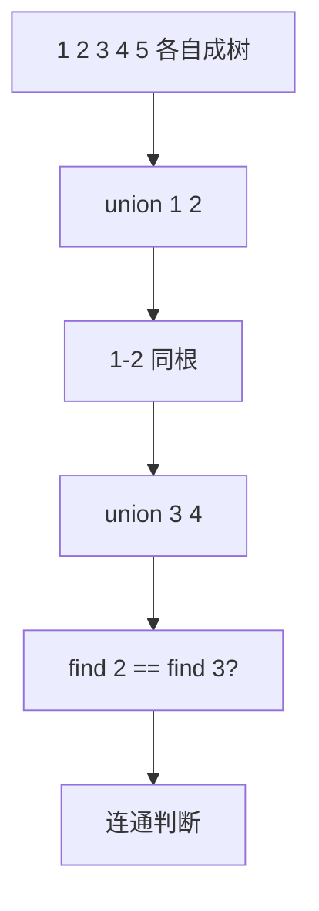

# 并查集

**并查集**（Disjoint Set Union，简称 DSU）是一种用于处理不相交集合的合并与查询问题的数据结构。

## 一、主要操作



1. **查找（Find）**：确定某个元素属于哪一个子集（返回所在集合的代表元素/根节点）
2. **合并（Union）**：将两个子集合并成一个集合
3. **连通判断（Connected）**：两个元素是否属于同一集合

**直观理解**：并查集维护一片"森林"，每棵树代表一个集合，树根是集合的代表：

```
初始状态（5个元素，各自成集合）：
  0   1   2   3   4

union(0,1), union(1,2), union(3,4):
      0       3
     / \       \
    1   ...     4
   /
  2

find(2) → 0, find(4) → 3
connected(0,2) → true, connected(0,3) → false
union(2,4) → 合并两棵树 → 所有元素同一集合
```

## 二、优化技术

### 路径压缩（Path Compression）

在执行查找操作时，将查找路径上的所有节点直接连接到根节点，使后续查找接近 O(1)：

```
压缩前:          find(3) 的过程:         压缩后:
    0                 0                     0
    |                / | \                 /|\
    1               1  2  3               1 2 3
    |
    2
    |
    3

find(3): 3→2→1→0，顺手把 3、2、1 都直接挂到 0 下面
```

### 按秩合并（Union by Rank）

在合并两个集合时，总是将高度较小的树合并到高度较大的树上，防止退化成链：

```
按秩合并:            不按秩（可能退化）:
    0                    0
   / \                   |
  1   2                  1
                         |
  3                      2
  |                      |
  4                      3
                         |
union(0,3):              4
  秩相同，0为根，秩+1     find(4) 要爬4层！
    0
   /|\
  1 2 3
       \
        4
```

**两个优化的协同效果**：单用路径压缩或单用按秩合并，复杂度都是 O(log n)；两者结合达到 O(α(n))。

## 三、代码实现

```java tab
public class UnionFind {
    private int[] parent;
    private int[] rank;
    private int count;  // 连通分量数

    public UnionFind(int size) {
        parent = new int[size];
        rank = new int[size];
        count = size;
        for (int i = 0; i < size; i++) {
            parent[i] = i;
            rank[i] = 1;
        }
    }

    public int find(int x) {
        if (parent[x] != x) {
            parent[x] = find(parent[x]); // 路径压缩
        }
        return parent[x];
    }

    public boolean union(int x, int y) {
        int rootX = find(x);
        int rootY = find(y);
        if (rootX == rootY) return false;  // 已连通

        // 按秩合并
        if (rank[rootX] > rank[rootY]) {
            parent[rootY] = rootX;
        } else if (rank[rootX] < rank[rootY]) {
            parent[rootX] = rootY;
        } else {
            parent[rootY] = rootX;
            rank[rootX]++;
        }
        count--;
        return true;
    }

    public boolean connected(int x, int y) {
        return find(x) == find(y);
    }

    public int getCount() {
        return count;
    }
}
```

```typescript tab
class UnionFind {
    private parent: number[];
    private rank: number[];
    count: number;  // 连通分量数

    constructor(size: number) {
        this.parent = Array.from({ length: size }, (_, i) => i);
        this.rank = new Array(size).fill(1);
        this.count = size;
    }

    find(x: number): number {
        if (this.parent[x] !== x) {
            this.parent[x] = this.find(this.parent[x]); // 路径压缩
        }
        return this.parent[x];
    }

    union(x: number, y: number): boolean {
        const rootX = this.find(x);
        const rootY = this.find(y);
        if (rootX === rootY) return false;  // 已连通

        // 按秩合并
        if (this.rank[rootX] > this.rank[rootY]) {
            this.parent[rootY] = rootX;
        } else if (this.rank[rootX] < this.rank[rootY]) {
            this.parent[rootX] = rootY;
        } else {
            this.parent[rootY] = rootX;
            this.rank[rootX]++;
        }
        this.count--;
        return true;
    }

    connected(x: number, y: number): boolean {
        return this.find(x) === this.find(y);
    }
}
```

```python tab
class UnionFind:
    def __init__(self, size: int):
        self.parent = list(range(size))
        self.rank = [1] * size
        self.count = size  # 连通分量数

    def find(self, x: int) -> int:
        if self.parent[x] != x:
            self.parent[x] = self.find(self.parent[x])  # 路径压缩
        return self.parent[x]

    def union(self, x: int, y: int) -> bool:
        root_x = self.find(x)
        root_y = self.find(y)
        if root_x == root_y:
            return False  # 已连通

        # 按秩合并
        if self.rank[root_x] > self.rank[root_y]:
            self.parent[root_y] = root_x
        elif self.rank[root_x] < self.rank[root_y]:
            self.parent[root_x] = root_y
        else:
            self.parent[root_y] = root_x
            self.rank[root_x] += 1
        self.count -= 1
        return True

    def connected(self, x: int, y: int) -> bool:
        return self.find(x) == self.find(y)
```

## 四、时间复杂度

| 操作 | 时间复杂度 |
|------|----------|
| 初始化 | O(n) |
| 查找 | O(α(n)) ≈ O(1) |
| 合并 | O(α(n)) ≈ O(1) |

其中 α(n) 是 Ackermann 函数的反函数，几乎是常数（α(2^65536) = 5，实际中永远不超过 5）。

**复杂度演进**：

| 版本 | find 复杂度 | 说明 |
|------|------------|------|
| 朴素（无优化） | O(n) | 退化为链表 |
| 仅按秩合并 | O(log n) | 树高有界 |
| 仅路径压缩 | O(log n) | 均摊分析 |
| 两者结合 | O(α(n)) | Tarjan 1975 年证明 |

## 五、经典应用：岛屿数量（并查集解法）

网格问题通常用 DFS/BFS，但并查集同样优雅——将相邻的陆地格子合并，最终数集合个数：

```java tab
public int numIslands(char[][] grid) {
    int m = grid.length, n = grid[0].length;
    UnionFind uf = new UnionFind(m * n);
    int water = 0;
    int[][] dirs = {{0,1},{1,0}};  // 只需右和下（避免重复合并）

    for (int i = 0; i < m; i++) {
        for (int j = 0; j < n; j++) {
            if (grid[i][j] == '0') { water++; continue; }
            for (int[] d : dirs) {
                int ni = i + d[0], nj = j + d[1];
                if (ni < m && nj < n && grid[ni][nj] == '1') {
                    uf.union(i * n + j, ni * n + nj);
                }
            }
        }
    }
    return uf.getCount() - water;  // 总集合数 - 水域格子数
}
```
```python tab
def num_islands(grid: list[list[str]]) -> int:
    m, n = len(grid), len(grid[0])
    uf = UnionFind(m * n)
    water = 0

    for i in range(m):
        for j in range(n):
            if grid[i][j] == '0':
                water += 1
                continue
            for di, dj in [(0, 1), (1, 0)]:
                ni, nj = i + di, j + dj
                if ni < m and nj < n and grid[ni][nj] == '1':
                    uf.union(i * n + j, ni * n + j)

    return uf.count - water
```

**技巧**：二维坐标 `(i, j)` 映射为一维下标 `i * n + j`，是网格并查集的标准操作。

## 六、带权并查集

在边上维护额外信息（距离、奇偶性、种类关系等），find 时沿路径累加权重：

```python tab
class WeightedUnionFind:
    """维护每个节点到根节点的距离（模意义下可做奇偶/种类判断）"""
    def __init__(self, size: int):
        self.parent = list(range(size))
        self.dist = [0] * size  # dist[x] = x 到 parent[x] 的距离

    def find(self, x: int) -> int:
        if self.parent[x] != x:
            root = self.find(self.parent[x])
            self.dist[x] += self.dist[self.parent[x]]  # 路径压缩时累加
            self.parent[x] = root
        return self.parent[x]

    def union(self, x: int, y: int, w: int) -> bool:
        """已知 x 到 y 的距离为 w，合并两个集合"""
        rx, ry = self.find(x), self.find(y)
        if rx == ry:
            return self.dist[x] - self.dist[y] == w  # 检查一致性
        self.parent[ry] = rx
        self.dist[ry] = self.dist[x] - self.dist[y] - w
        return True

    def query(self, x: int, y: int) -> int | None:
        """查询 x 到 y 的距离（不连通返回 None）"""
        if self.find(x) != self.find(y):
            return None
        return self.dist[x] - self.dist[y]
```

**典型题目**：LC 399 除法求值（带权并查集 or BFS）、食物链（种类并查集，权 mod 3）。

## 七、可撤销并查集

路径压缩会破坏历史状态，无法回退。如果题目需要"撤销最近一次合并"（如离线处理动态图），使用**按秩合并 + 栈记录**：

```python tab
class UndoableUnionFind:
    def __init__(self, size: int):
        self.parent = list(range(size))
        self.size = [1] * size
        self.history = []  # 记录每次合并的操作

    def find(self, x: int) -> int:
        while self.parent[x] != x:  # 不路径压缩！
            x = self.parent[x]
        return x

    def union(self, x: int, y: int) -> bool:
        rx, ry = self.find(x), self.find(y)
        if rx == ry:
            self.history.append(None)
            return False
        if self.size[rx] < self.size[ry]:
            rx, ry = ry, rx
        self.parent[ry] = rx
        self.size[rx] += self.size[ry]
        self.history.append((ry, rx))
        return True

    def undo(self) -> None:
        op = self.history.pop()
        if op:
            ry, rx = op
            self.size[rx] -= self.size[ry]
            self.parent[ry] = ry
```

## 八、应用场景总结

| 场景 | 建模方式 | 典型题目 |
|------|----------|----------|
| 动态连通性 | 每次 union 后查询 | 冗余连接（LC 684） |
| 连通分量计数 | 维护 count | 省份数量（LC 547） |
| 最小生成树 | Kruskal 判环 | 连接所有点的最小费用（LC 1584） |
| 网格连通 | 坐标映射一维 | 岛屿数量（LC 200） |
| 等式方程 | 相等关系合并 | 等式方程的可满足性（LC 990） |
| 带权关系 | 边权累加 | 除法求值（LC 399） |
| 二分图检测 | 种类并查集 | 可能的二分法（LC 886） |

## 九、面试真题

| 题目 | 难度 | 核心思路 |
|------|------|----------|
| 省份数量（LC 547） | 🟡 Medium | 合并所有相连城市，数集合数 |
| 冗余连接（LC 684） | 🟡 Medium | union 返回 false 的边就是答案 |
| 冗余连接 II（LC 685） | 🔴 Hard | 有向图：入度2 or 环 |
| 岛屿数量（LC 200） | 🟡 Medium | 网格并查集 or DFS |
| 被围绕的区域（LC 130） | 🟡 Medium | 边界格子与虚拟节点合并 |
| 等式方程的可满足性（LC 990） | 🟡 Medium | 先合并所有 ==，再检查 != |
| 除法求值（LC 399） | 🟡 Medium | 带权并查集 |
| 按字典序排列最小的等效字符串（LC 1061） | 🟡 Medium | 合并等价字符，取最小代表 |
| 最长连续序列（LC 128） | 🟡 Medium | 哈希 or 并查集合并相邻数 |

## 十、易错点分析

**1. find 中忘记路径压缩的赋值**

```java
// ❌ 只找了根，没压缩
public int find(int x) {
    if (parent[x] != x) return find(parent[x]);
    return x;
}
// ✅ 压缩：把结果写回 parent[x]
public int find(int x) {
    if (parent[x] != x) parent[x] = find(parent[x]);
    return parent[x];
}
```

**2. union 时忘记先 find**

```java
// ❌ 直接比较 x 和 y 的 parent —— 它们可能不是根
if (parent[x] == parent[y]) return;
// ✅ 必须先找到各自的根
int rootX = find(x), rootY = find(y);
```

**3. 网格题坐标映射错误**

```java
// ❌ i * m + j（m 是行数）
// ✅ i * n + j（n 是列数）
uf.union(i * n + j, ni * n + nj);
```

**4. 递归路径压缩导致栈溢出**

极端情况（10⁵ 个节点的链）递归深度可能爆栈。可改用迭代版：

```java
public int find(int x) {
    int root = x;
    while (parent[root] != root) root = parent[root];
    while (parent[x] != root) {  // 第二遍压缩
        int next = parent[x];
        parent[x] = root;
        x = next;
    }
    return root;
}
```
