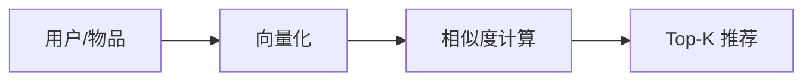

# 向量空间与推荐系统


## 一、问题背景



音乐 App 如何"猜你喜欢"？电商如何"为你推荐"？

推荐系统的核心思路只有两句话：

1. 找到跟你**口味相似的用户**，把他们喜欢的推荐给你
2. 找出跟你喜爱的物品**特征相似的物品**，推荐给你

这两种思路的底层数学工具都是：**向量空间 + 距离计算**。

## 二、用户行为的向量化

### 2.1 构建评分矩阵

将用户对物品的喜爱程度量化为分数：

| 行为 | 得分 |
|------|------|
| 收藏/购买 | 5 |
| 完整播放/阅读 | 4 |
| 点赞 | 3 |
| 部分浏览 | 2 |
| 点击即走 | 1 |

每个用户对应一个**向量**，维度 = 物品数量：

```text
用户A: [5, 3, 0, 4, 2]
用户B: [4, 4, 1, 3, 0]
用户C: [1, 0, 5, 2, 4]
```

### 2.2 高维空间中的"距离"

每个用户是 K 维空间中的一个点。口味相似 → 空间中距离近。

## 三、相似度度量

### 3.1 欧几里得距离

\[
d(A, B) = \sqrt{\sum_{i=1}^{K}(A_i - B_i)^2}
\]

- 距离越小 → 越相似
- 直观，但对量纲敏感

### 3.2 余弦相似度

\[
\cos(\theta) = \frac{A \cdot B}{|A| \times |B|} = \frac{\sum A_i B_i}{\sqrt{\sum A_i^2} \times \sqrt{\sum B_i^2}}
\]

- 值域 [-1, 1]，越接近 1 越相似
- **不受向量长度影响**，只关注方向
- 推荐系统中最常用

### 3.3 对比

| 度量 | 适用场景 | 特点 |
|------|----------|------|
| 欧氏距离 | 绝对差异敏感 | 受量纲影响 |
| 余弦相似度 | 关注"方向"而非"大小" | 推荐/文本相似度首选 |
| 皮尔逊相关 | 评分尺度不同的用户 | 去均值后的余弦 |

## 四、基于用户的协同过滤（UserCF）

### 4.1 算法流程

1. 计算目标用户与所有用户的相似度
2. 选出 Top-K 个最相似用户
3. 将这些相似用户喜欢、但目标用户未接触过的物品推荐出来
4. 按加权得分排序

### 4.2 代码实现

```python tab
import math

def cosine_similarity(a, b):
    dot = sum(x * y for x, y in zip(a, b))
    norm_a = math.sqrt(sum(x * x for x in a))
    norm_b = math.sqrt(sum(x * x for x in b))
    if norm_a == 0 or norm_b == 0:
        return 0
    return dot / (norm_a * norm_b)

def user_cf(target_user, user_ratings, k=3):
    """基于用户的协同过滤推荐"""
    similarities = []
    for user, ratings in user_ratings.items():
        if user == target_user:
            continue
        sim = cosine_similarity(user_ratings[target_user], ratings)
        similarities.append((user, sim))

    # 取 Top-K 相似用户
    similarities.sort(key=lambda x: -x[1])
    top_k = similarities[:k]

    # 加权推荐
    scores = {}
    for user, sim in top_k:
        for item, rating in enumerate(user_ratings[user]):
            if user_ratings[target_user][item] == 0 and rating > 0:
                scores[item] = scores.get(item, 0) + sim * rating

    return sorted(scores.items(), key=lambda x: -x[1])
```

```java tab
public class UserCF {
    public static double cosineSimilarity(double[] a, double[] b) {
        double dot = 0, normA = 0, normB = 0;
        for (int i = 0; i < a.length; i++) {
            dot += a[i] * b[i];
            normA += a[i] * a[i];
            normB += b[i] * b[i];
        }
        if (normA == 0 || normB == 0) return 0;
        return dot / (Math.sqrt(normA) * Math.sqrt(normB));
    }

    public static List<int[]> recommend(double[][] ratings, int targetUser, int k) {
        int n = ratings.length;
        double[][] sims = new double[n][2]; // [userId, similarity]
        for (int i = 0; i < n; i++) {
            if (i == targetUser) continue;
            sims[i][0] = i;
            sims[i][1] = cosineSimilarity(ratings[targetUser], ratings[i]);
        }
        Arrays.sort(sims, (a, b) -> Double.compare(b[1], a[1]));

        Map<Integer, Double> scores = new HashMap<>();
        for (int i = 0; i < k; i++) {
            int user = (int) sims[i][0];
            double sim = sims[i][1];
            for (int item = 0; item < ratings[user].length; item++) {
                if (ratings[targetUser][item] == 0 && ratings[user][item] > 0) {
                    scores.merge(item, sim * ratings[user][item], Double::sum);
                }
            }
        }
        return scores.entrySet().stream()
            .sorted(Map.Entry.<Integer, Double>comparingByValue().reversed())
            .map(e -> new int[]{e.getKey()})
            .collect(Collectors.toList());
    }
}
```

## 五、基于物品的协同过滤（ItemCF）

### 5.1 思路

将矩阵**转置**：每个物品对应一个向量（维度=用户数），计算物品间相似度。

```text
歌曲A被用户评分: [5, 4, 1, 0, 3]
歌曲B被用户评分: [4, 5, 2, 0, 4]
→ A和B的余弦相似度很高 → 喜欢A的人也喜欢B
```

### 5.2 UserCF vs ItemCF

| 对比 | UserCF | ItemCF |
|------|--------|--------|
| 适用场景 | 用户少、物品多 | 物品少、用户多 |
| 实时性 | 用户兴趣变化快 | 物品关系相对稳定 |
| 典型产品 | 新闻推荐 | 电商/音乐推荐 |
| 冷启动 | 新用户难处理 | 新物品难处理 |

## 六、工程挑战

| 问题 | 解决方案 |
|------|----------|
| 冷启动 | 基于内容推荐（标签/类别） |
| 数据稀疏 | 降维（SVD）、填充默认值 |
| 计算量大 | 离线预计算 + 在线 Top-K |
| 马太效应 | 引入随机性/探索策略 |

## 七、总结

推荐系统的数学本质：

1. 将用户/物品映射为**高维向量**
2. 用**距离/相似度**度量关系
3. 基于"近邻"做预测和推荐

核心公式：余弦相似度 = 向量点积 / 向量模之积

这个简单的数学工具，支撑了价值千亿的推荐产业。
